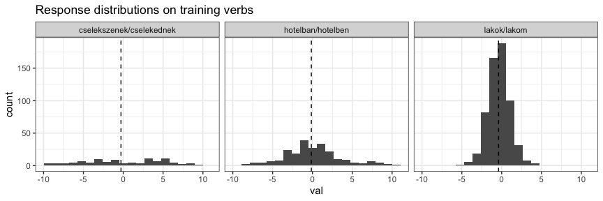
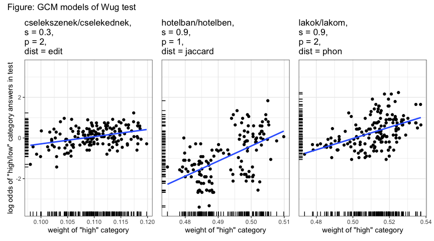

Phonological categorisation models
================
Rácz, Péter
2023-12-21

## Phonological categorisation models

1.  Generate natural classes from a language’s phonological feature
    matrix
2.  Generate segment-distances from the natural classes
3.  Generate word-distances from the segment-distances using a word
    aligner
4.  Generate categories from the word distances and an algo

## Quick start

We do this below but in detail:

``` r
# a. generate natural classes

nch = h |>
  generateNaturalClasses()

# b. build distance table for pairwise segment comparisons

lookup_h = buildDistTable(h, nch) |>
  addLevenshtein()

# c. align test and target words to find best phon-based alignment, here, for the 'lakok/lakom' variation

alignments_lakok = runLookup(test,training,'lakok/lakom',lookup_h)

# d. get distance based on best alignment, here, for lakok. this takes ages.

word_distance_lakok = alignments_lakok |>
  dplyr::distinct(test,training,total_dist,variation)

# e. use the paired data to fit some sort of a phon distance based learning model, here, a KNN

KNN(dat = word_distance_lakok, variation_type = 'lakok/lakom', distance_type = 'phon', s = .1, k = 3)

# f. join the output with the test data and check how well model predictions correlate with test data.
```

## 1. Generate natural classes

The feature matrix was adapted from Siptár and Törkenczy (2000). “ṯ”,
“ḏ”, and “ṉ” are the palatal stops. “c” is “ts”. Here is a sample of the
feature matrix.

| segment | cons | son | cont | labial | coronal | anterior | dorsal | lateral | voice | delrel | seg | long | open1 | open2 |
|:--------|:-----|:----|:-----|:-------|:--------|:---------|:-------|:--------|:------|:-------|:----|:-----|:------|:------|
| ő       | \-   |     | \+   | \+     | \+      |          | \-     |         |       |        | \+  | \+   | \-    | \+    |
| m       | \+   | \+  | \-   | \+     |         |          |        |         | \+    |        | \+  |      |       |       |
| b       | \+   | \-  | \-   | \+     |         |          |        |         | \+    |        | \+  |      |       |       |
| v       | \+   |     | \+   | \+     |         |          |        |         | \+    |        | \+  |      |       |       |
| c       | \+   | \-  | \-   |        | \+      | \+       |        |         | \-    | \+     | \+  |      |       |       |
| ṉ       | \+   | \+  | \-   |        | \+      | \-       |        |         | \+    |        | \+  |      |       |       |
| g       | \+   | \-  | \-   |        |         |          | \+     |         | \+    |        | \+  |      |       |       |
| é       | \-   |     | \+   | \-     | \+      |          | \-     |         |       |        | \+  | \+   | \+    | \+    |
| ṯ       | \+   | \-  | \-   |        | \+      | \+       |        |         | \-    |        | \+  |      |       |       |
| i       | \-   |     | \+   | \-     | \+      |          | \-     |         |       |        | \+  | \-   | \-    | \-    |

Sample of the phonological feature matrix

We turn it into underspecified natural class descriptions following
Albrighty and Hayes (2003) and Frisch, Pierrehumbert, and Broe (2004).

``` r
nch = h |>
  generateNaturalClasses()

write_tsv(nch, 'dat/natural_classes/siptar_torkenczy_toth_racz_hungarian_nc.tsv')
```

Here’s a sample of what the output looks like.

| feature_bundle                       | segments                                                            |
|:-------------------------------------|:--------------------------------------------------------------------|
| \[+cons\]                            | p, b, f, v, m, t, d, s, z, c, n, l, r, ṯ, ḏ, š, ž, č, ṉ, j, k, g, h |
| \[+labial, -voice\]                  | p, f                                                                |
| \[-cont, +coronal, -voice\]          | t, c, ṯ, č                                                          |
| \[-son, -anterior\]                  | ḏ, š, ž, č                                                          |
| \[+labial, +coronal, +long, -open2\] | ű                                                                   |
| \[+coronal, +long, -open+\]          | í, ő, ű                                                             |
| \[-cont, +anterior, -voice\]         | t, c, ṯ                                                             |
| \[+coronal, -long, -open+\]          | i, ö, ü                                                             |
| \[+dorsal, +voice\]                  | g                                                                   |
| \[-son, +cont, +voice\]              | z, ž                                                                |

Sample of the natural classes

## 2. Generate segment-distances from the natural classes

We use the natural classes to calculate segment distances and add edit
distances: any segment vs nothing is 1.

``` r
lookup_h = buildDistTable(h, nch) |>
  addLevenshtein()

write_tsv(lookup_h, 'dat/segmental_distances/siptar_torkenczy_toth_racz_hungarian_dt.tsv')
```

Here’s a sample of what the output looks like.

| segment1 | segment2 | dist |
|:---------|:---------|-----:|
| á        | ú        | 0.77 |
| í        | v        | 0.94 |
| ž        | r        | 0.76 |
| n        | í        | 0.95 |
| i        | ö        | 0.67 |
| ṯ        | ő        | 0.95 |
| o        | í        | 0.90 |
| ő        | s        | 0.91 |
| ü        | h        | 0.93 |
| ú        | c        | 0.98 |

Sample of the segmental distances

Here’s what segmental distances look like in the output, across 3
dimensions.

<!-- -->

## 3. Generate word-distances from the segment-distances using a word aligner

We want to find the alignment between word 1 and word 2 where the
pairwise comparison of their segments yields the smallest total
distance. We can skip slots. This is a good alignment:

    a s t r á l
    o s t   á j 

This isn’t:

    a s t r á l
    o s t á j 

For each word pair, we do every conceivable alignment and pick the one
with the shortest total distance. This will be the pair with the
smallest total phonological distance. This process is resource
intensive. For this, we need the two words and the lookup table
generated in step 2. The resulting table shows the two strings in their
bestalignment (col 1 and 2), the distances between the segments (dist,
this is 0 for identical segments and 1 for deletion / insertion) and the
total distance (sum of dist, which is the same value for the whole
aignment).

``` r
alignWords('astrál', 'ostáj', lookup_h) %>% 
  kable(digits = 2, caption = 'Sample alignment 1')
```

| segment1 | segment2 | dist | total_dist |
|:---------|:---------|-----:|-----------:|
| a        | o        | 0.62 |       2.07 |
| s        | s        | 0.00 |       2.07 |
| t        | t        | 0.00 |       2.07 |
| r        |          | 1.00 |       2.07 |
| á        | á        | 0.00 |       2.07 |
| l        | j        | 0.45 |       2.07 |

Sample alignment 1

Some of this is less intuitive, because sometimes the best alignment is
ceteris paribus not the one you’d expect, see:

``` r
alignWords('astalka', 'astrál', lookup_h) %>% 
  kable(digits = 2, caption = 'Sample alignment 2')
```

| segment1 | segment2 | dist | total_dist |
|:---------|:---------|-----:|-----------:|
| a        | a        | 0.00 |       2.97 |
| s        | s        | 0.00 |       2.97 |
| t        | t        | 0.00 |       2.97 |
| a        |          | 1.00 |       2.97 |
| l        | r        | 0.12 |       2.97 |
| k        | á        | 0.92 |       2.97 |
| a        | l        | 0.94 |       2.97 |

Sample alignment 2

Apparently comparing the final `ka$` to the final `ál\$` is a better
bargain than skipping 1 segment and gaining a penalty of 1 and then
comparing `ka \$` to `ál\$`.

This is based on Albrighty and Hayes (2003) and Dawdy-Hesterberg and
Pierrehumbert (2014).

## 4. Generate categories from the word distances and an algo

I have some training and test data for three variable patterns in
Hungarian. See the preprint for details.

1.  inflectional: 1sg.indef variation: lakok/lakom (“I live”)
2.  inflectional: vowel deletion: cselekszenek/cselekednek (“they act”)
3.  declensional: vowel harmony: hotelban/hotelben (“in the hotel”)

- training data come from Hungarian webcorpus 2.
- test data come from a wug task where people responded to prompts in a
  forced-choice format. about 30 people responded to each prompt. they
  came from a student pool. See the preprint for details. (The preprint
  only talks about a and b right now, but it covers methods and ethics
  for c as well.)

Training data look like this:

| base        | variation                | lemma_freq_corrected | string    | log_odds | ranef |
|:------------|:-------------------------|---------------------:|:----------|---------:|------:|
| lúdbőrzik   | cselekszenek/cselekednek |                16048 | lúdbőrz   |       NA | -6.99 |
| hólyagzik   | cselekszenek/cselekednek |                  596 | hójagz    |       NA |  2.00 |
| oszlik      | cselekszenek/cselekednek |              8076952 | osl       |       NA |  3.31 |
| döglik      | cselekszenek/cselekednek |              2240613 | dögl      |       NA |  3.75 |
| kotlik      | cselekszenek/cselekednek |               108182 | kotl      |       NA |  4.59 |
| modem       | hotelban/hotelben        |                54652 | modem     |       NA | -3.81 |
| acél        | hotelban/hotelben        |               172196 | acél      |       NA |  7.97 |
| hátér       | hotelban/hotelben        |                 2755 | hátér     |       NA | -3.35 |
| nonszensz   | hotelban/hotelben        |                16551 | nonsens   |       NA | -4.15 |
| kóter       | hotelban/hotelben        |                  752 | kóter     |       NA |  1.07 |
| rugaszkodik | lakok/lakom              |                 7279 | rugaskod  |    -1.01 |    NA |
| éhezik      | lakok/lakom              |                59636 | éhez      |     0.74 |    NA |
| jógázik     | lakok/lakom              |                17732 | jógáz     |    -1.44 |    NA |
| berzenkedik | lakok/lakom              |                 3632 | berzenked |    -0.24 |    NA |
| dicsekszik  | lakok/lakom              |                46395 | dičeks    |    -3.52 |    NA |

Sample of the training data

For ‘lakok/lakom’, there is one exponent that varies and you can count
the two forms (lakok, lakom) per verb and calculate log odds. The other
two vary across a range of suffixes, the suffixes themselves have
different total frequencies, so I fit a mixed model predicting
`cbind(freq1,freq2)` with a stem and suffix intercept. I then extracted
the stem random effects and include these here as `ranef`.

Training data was restricted to exclude less frequent and very long
forms. This is fairly arbitrary.

Test data look like this:

| base                   | variation                | variant1    | variant2    | resp1 | resp2 | string  |
|:-----------------------|:-------------------------|:------------|:------------|------:|------:|:--------|
| prögzik / prögözik     | cselekszenek/cselekednek | prögzötök   | prögöztök   |     9 |    18 | prögz   |
| flűgzik / flűgözik     | cselekszenek/cselekednek | flűgzünk    | flűgözünk   |    17 |    12 | flűgz   |
| klarágzik / klarágozik | cselekszenek/cselekednek | klarágzotok | klarágoztok |     7 |    19 | klarágz |
| nágapszik / nágapodik  | cselekszenek/cselekednek | nágapszanak | nágapodnak  |    15 |    11 | nágaps  |
| pörzik / pörözik       | cselekszenek/cselekednek | pörzötök    | pöröztök    |    11 |    16 | pörz    |
| humék                  | hotelban/hotelben        | huméknak    | huméknek    |    13 |    13 | humék   |
| lorzens                | hotelban/hotelben        | lorzensnál  | lorzensnél  |     5 |    22 | lorzenš |
| pítend                 | hotelban/hotelben        | pítendban   | pítendben   |     3 |    26 | pítend  |
| jukél                  | hotelban/hotelben        | jukélnál    | jukélnél    |    12 |    15 | jukél   |
| vorszen                | hotelban/hotelben        | vorszennál  | vorszennél  |     4 |    25 | vorsen  |
| spibádzik              | lakok/lakom              | spibádzok   | spibádzom   |    12 |    15 | špibádz |
| sztruglik              | lakok/lakom              | sztruglok   | sztruglom   |    16 |    10 | strugl  |
| hűgzik                 | lakok/lakom              | hűgzök      | hűgzöm      |    13 |    13 | hűgz    |
| spülöklik              | lakok/lakom              | spülöklök   | spülöklöm   |    15 |    11 | špülökl |
| narádzik               | lakok/lakom              | narádzok    | narádzom    |     9 |    18 | narádz  |

Sample of the test data

`string` is transcribed using a simple converter that maps Hungarian
orthography to IPA.

For each variation, you pair test and training words and calc word
distance.

``` r
# this legitimately takes a while.

# run the lookup for all variations
alignments_lakok = runLookup(test,training,'lakok/lakom',lookup_h)
alignments_cselekszenek = runLookup(test,training,'cselekszenek/cselekednek',lookup_h)
alignments_hotelban = runLookup(test,training,'hotelban/hotelben',lookup_h)

# write_tsv(alignments_lakok, 'dat/alignments/alignments_lakok.tsv')
# write_tsv(alignments_cselekszenek, 'dat/alignments/alignments_cselekszenek.tsv')
# write_tsv(alignments_hotelban, 'dat/alignments/alignments_hotelban.tsv')
```

We now have best alignments for training : test data. These might be
useful someday, like if we want to build a rule-based learner. They look
like this. On the left are three nonce words used in the Wug task. On
the right there are three aligned training words. This is just three
examples. Note that we deleted the verbal “ik” ending because that’s the
same everywhere and this speeds up computation.

| test   | training | segment1 | segment2 | dist | total_dist |
|:-------|:---------|:---------|:---------|-----:|-----------:|
| narádz | bábáškod | n        | b        | 0.84 |       5.84 |
| narádz | bábáškod | a        | á        | 0.58 |       5.84 |
| narádz | bábáškod | r        | b        | 0.94 |       5.84 |
| narádz | bábáškod | á        | á        | 0.00 |       5.84 |
| narádz | bábáškod |          | š        | 1.00 |       5.84 |
| narádz | bábáškod | d        | k        | 0.84 |       5.84 |
| narádz | bábáškod |          | o        | 1.00 |       5.84 |
| narádz | bábáškod | z        | d        | 0.63 |       5.84 |
| šalárz | kérked   | š        | k        | 0.86 |       4.21 |
| šalárz | kérked   | a        | é        | 0.81 |       4.21 |
| šalárz | kérked   | l        | r        | 0.12 |       4.21 |
| šalárz | kérked   | á        | k        | 0.92 |       4.21 |
| šalárz | kérked   | r        | e        | 0.88 |       4.21 |
| šalárz | kérked   | z        | d        | 0.63 |       4.21 |
| streml | vesőd    | s        | v        | 0.87 |       5.11 |
| streml | vesőd    | t        | e        | 0.95 |       5.11 |
| streml | vesőd    | r        | s        | 0.64 |       5.11 |
| streml | vesőd    | e        | ő        | 0.79 |       5.11 |
| streml | vesőd    | m        | d        | 0.86 |       5.11 |
| streml | vesőd    | l        |          | 1.00 |       5.11 |

What we actually need is the total distances.

The final result looks like this:

| test    | training  | variation                | phon_dist |
|:--------|:----------|:-------------------------|----------:|
| trlik   | harags    | cselekszenek/cselekednek |      4.28 |
| trlik   | als       | cselekszenek/cselekednek |      3.73 |
| flodl   | háml      | cselekszenek/cselekednek |      3.25 |
| kűdl    | ivarz     | cselekszenek/cselekednek |      3.94 |
| klehéṉl | dögl      | cselekszenek/cselekednek |      5.29 |
| šihen   | kaštéɲ    | hotelban/hotelben        |      4.44 |
| hošét   | balett    | hotelban/hotelben        |      3.78 |
| jalréɲ  | kóter     | hotelban/hotelben        |      4.92 |
| hivép   | puffer    | hotelban/hotelben        |      4.67 |
| čodeg   | popper    | hotelban/hotelben        |      3.53 |
| jusl    | šegédkez  | lakok/lakom              |      7.00 |
| špibakl | erőlköd   | lakok/lakom              |      6.32 |
| narádz  | bábáškod  | lakok/lakom              |      5.84 |
| zödl    | gondolkod | lakok/lakom              |      6.44 |
| špüsl   | faḏoškod  | lakok/lakom              |      6.62 |

Word distances for nonce words in the Wug task and their aligned
training words.

## 4. Model!

The nonce verbs got variable responses in the Wug task and have a
specific similarity to existing verbs. We want to see whether similarity
to existing verbs predicts variable responses. To calculate class
similarity, we need to categorise the verbs into classes. We look at
variable distributions and create category labels so we have something
to work with.

``` r
training %>% 
  mutate(
    val = ifelse(is.na(log_odds),ranef,log_odds)
  ) %>% 
  group_by(variation) %>% 
  mutate(
    median_val = median(val)
  ) %>%
  ggplot(aes(x = val)) +
  geom_histogram(bins = 20) +
  geom_vline(aes(xintercept = median_val), linetype = 'dashed') +
  facet_wrap(~variation) +
  # no x and y lab
  theme(axis.title.x = element_blank(),
        axis.title.y = element_blank()) +
  theme_bw() +
  ggtitle('Response distributions on training verbs')
```

<!-- -->

“cselekszenek” and “hotelban” are somewhat visibly bimodal. “lakok” not
so much. We split them each across the distribution’s median.

The end result looks like this. This is distances between test words and
training words and responses to test words and training word category.

| variation                | test_label             | training_label | category | phon_dist |
|:-------------------------|:-----------------------|:---------------|:---------|----------:|
| cselekszenek/cselekednek | dibáglik / dibágozik   | iramlik        | high     |      3.27 |
| cselekszenek/cselekednek | virzik / virozik       | világlik       | low      |      2.80 |
| cselekszenek/cselekednek | tribejlik / tribejezik | párzik         | high     |      5.46 |
| cselekszenek/cselekednek | fröjlik / fröjözik     | villámlik      | high     |      4.47 |
| cselekszenek/cselekednek | trálaklik / trálakozik | sugárzik       | low      |      5.50 |
| hotelban/hotelben        | luméz                  | kastély        | high     |      4.35 |
| hotelban/hotelben        | brindez                | tanszék        | low      |      4.95 |
| hotelban/hotelben        | tumély                 | alélt          | high     |      4.11 |
| hotelban/hotelben        | dajrens                | obszcén        | high     |      5.09 |
| hotelban/hotelben        | jóbec                  | sóher          | low      |      2.33 |
| lakok/lakom              | jüslik                 | veszik         | high     |      3.04 |
| lakok/lakom              | spűmlik                | búvárkodik     | low      |      6.82 |
| lakok/lakom              | huklik                 | kapcsolódik    | low      |      6.13 |
| lakok/lakom              | vihepszik              | következik     | low      |      5.35 |
| lakok/lakom              | frodlik                | szomjazik      | low      |      4.95 |

Word distances for nonce words in the Wug task and their aligned
training words, with training word category and test word response log
odds (large log odds: lot of “high” responses).

### KNN

We categorise test words based on similarity with training words using a
K-Nearest Neighbours algorithm. We try `k = [1,3,7]`, `s = [.1,.5,.9]`
and edit distance, jaccard distance, and phonological distance (the
whole shebang above).

``` r
# set up parameters
my_parameters_1 = crossing(
  k = c(1,3,7,15),
  s = c(.1,.5,.9),
  sim = c('edit','jaccard','phon'),
  variation = c('lakok/lakom','hotelban/hotelben','cselekszenek/cselekednek')
)

# run models
my_knns = my_parameters_1 %>% 
  mutate(
    knn = pmap(list(k,s,sim,variation), ~ KNN(
      dat = word_distance,
      var_s = ..2,
      var_k = ..1,
      var_p = 1,
      distance_type = ..3,
      variation_type = ..4
    ))
  )

# combine results with test responses
combineWithTest = function(dat){
  test %>% 
  rename(test = string) %>% 
  select(test,resp1,resp2,log_odds) %>% 
  inner_join(dat, by = 'test')
}

# fit a model that predicts response rations from category labels and pulls the summary
testAccuracy = function(dat){
  fit = glm(cbind(resp1,resp2) ~ 1 + category_high, data = dat, family = binomial(link = 'logit'))
  broom::tidy(fit) %>% 
    filter(term == 'category_high')
}

# combine with test and calc accuracy
my_knns %<>% 
  mutate(
    knn2 = map(knn,combineWithTest),
    accuracy = map(knn2,testAccuracy)
  )

my_knns2 = my_knns %>% 
  select(-knn,-knn2) %>% 
  unnest(accuracy)
```

|   k |   s | sim     | variation                | term          | estimate | std.error | statistic | p.value |
|----:|----:|:--------|:-------------------------|:--------------|---------:|----------:|----------:|--------:|
|   3 | 0.1 | phon    | cselekszenek/cselekednek | category_high |     0.09 |      0.09 |      1.00 |    0.32 |
|  15 | 0.1 | jaccard | hotelban/hotelben        | category_high |     2.79 |      0.20 |     13.86 |    0.00 |
|   7 | 0.1 | edit    | lakok/lakom              | category_high |     1.40 |      0.13 |     10.43 |    0.00 |

Best KNN model for each variation.

For ‘cselekszenek/cselekednek’, even the best KNN model is terrible. For
‘lakok/lakom’, the best KNN model uses 7 neighbours, an s of .1, and,
most importantly, edit distance, rather than phonological distance. For
‘cselekzenek/cselekednek’, the best KNN model uses 15 neighbours, an s
of .1, and, most importantly, edit distance, rather than phonological
distance. For ‘hotelban/hotelben’, the best KNN model uses 7 neighbours,
an s of .1, and jaccard distance.

|   k |   s | sim     | variation                | term          | estimate | std.error | statistic | p.value |
|----:|----:|:--------|:-------------------------|:--------------|---------:|----------:|----------:|--------:|
|   7 | 0.1 | edit    | cselekszenek/cselekednek | category_high |     0.00 |      0.11 |      0.00 |    1.00 |
|   3 | 0.1 | jaccard | cselekszenek/cselekednek | category_high |    -0.02 |      0.09 |     -0.24 |    0.81 |
|   3 | 0.1 | phon    | cselekszenek/cselekednek | category_high |     0.09 |      0.09 |      1.00 |    0.32 |
|  15 | 0.1 | edit    | hotelban/hotelben        | category_high |     3.04 |      0.22 |     13.81 |    0.00 |
|  15 | 0.1 | jaccard | hotelban/hotelben        | category_high |     2.79 |      0.20 |     13.86 |    0.00 |
|  15 | 0.1 | phon    | hotelban/hotelben        | category_high |     2.80 |      0.21 |     13.28 |    0.00 |
|   7 | 0.1 | edit    | lakok/lakom              | category_high |     1.40 |      0.13 |     10.43 |    0.00 |
|   7 | 0.1 | jaccard | lakok/lakom              | category_high |     0.51 |      0.15 |      3.41 |    0.00 |
|  15 | 0.1 | phon    | lakok/lakom              | category_high |     1.29 |      0.15 |      8.43 |    0.00 |

Best KNN model for each variation and distance type.

We can compare the best models across all three distances.
‘cselekszenek’ is just universally terrible, suggesting that either
people treat this one very differently from the other two or that our
training set is not the right one. (We have independent grounds to
assume that it’s the latter.) Edit distance works pretty well for both
other patterns (for ‘hotelban’ there’s very little difference between
the best edit-based and the best jaccard-based model), jaccard distance
only seems to cut it for ‘hotelban’.

The best models based on phonological distance do something. But they
are worse for both ‘lakok’ and ‘hotelban’ than the edit/jaccard distance
based ones.

Let’s visualise the best model for each variation type.

<!-- -->

### GCM

We categorise test words based on similarity with training words using
the Generalised Context Model. We try `p = [1,2]`,
`s = [.1,.3,.5,.7,.9]` and edit distance, jaccard distance, and
phonological distance.

``` r
# set up parameters
my_parameters_2 = crossing(
  p = c(1,2),
  s = c(.1,.3,.5,.7,.9),
  sim = c('edit','jaccard','phon'),
  variation = c('lakok/lakom','hotelban/hotelben','cselekszenek/cselekednek')
)

# run models
my_gcms = my_parameters_2 %>% 
  mutate(
    gcm = pmap(list(s,sim,variation,p), ~ lookupGCM(
      var_p = ..4,
      dat = word_distance,
      distance_type  = ..2,
      variation_type = ..3,
      var_s = ..1
    ))
  )

# combine with test and calc accuracy
my_gcms %<>% 
  mutate(
    gcm2 = map(gcm,combineWithTest),
    accuracy = map(gcm2,testAccuracy)
  )

my_gcms2 = my_gcms %>% 
  select(-gcm,-gcm2) %>% 
  unnest(accuracy)
```

|   p |   s | sim     | variation                | term          | estimate | std.error | statistic | p.value |
|----:|----:|:--------|:-------------------------|:--------------|---------:|----------:|----------:|--------:|
|   1 | 0.9 | phon    | cselekszenek/cselekednek | category_high |     0.09 |      0.22 |      0.42 |    0.67 |
|   1 | 0.7 | jaccard | hotelban/hotelben        | category_high |    50.11 |      2.87 |     17.44 |    0.00 |
|   1 | 0.9 | phon    | lakok/lakom              | category_high |     6.42 |      0.60 |     10.76 |    0.00 |

Best GCM model for each variation.

‘cselekszenek/cselekednek’ is hopeless. The best model uses phonological
distance for “lakok/lakom” and jaccard distance for “hotelban/hotelben”.

For ‘hotelban’, the best GCM model uses jaccard distance and is a marked
improvement over the KNN model. For ‘lakok’, the best GCM model is on
par with the best KNN model.

|   p |   s | sim     | variation                | term          | estimate | std.error | statistic | p.value |
|----:|----:|:--------|:-------------------------|:--------------|---------:|----------:|----------:|--------:|
|   1 | 0.9 | edit    | cselekszenek/cselekednek | category_high |    -0.04 |      0.19 |     -0.22 |    0.82 |
|   2 | 0.1 | jaccard | cselekszenek/cselekednek | category_high |    -0.01 |      0.09 |     -0.11 |    0.91 |
|   1 | 0.9 | phon    | cselekszenek/cselekednek | category_high |     0.09 |      0.22 |      0.42 |    0.67 |
|   1 | 0.9 | edit    | hotelban/hotelben        | category_high |     6.67 |      0.40 |     16.68 |    0.00 |
|   1 | 0.7 | jaccard | hotelban/hotelben        | category_high |    50.11 |      2.87 |     17.44 |    0.00 |
|   1 | 0.9 | phon    | hotelban/hotelben        | category_high |     9.57 |      0.59 |     16.25 |    0.00 |
|   1 | 0.9 | edit    | lakok/lakom              | category_high |     4.89 |      0.47 |     10.32 |    0.00 |
|   1 | 0.9 | jaccard | lakok/lakom              | category_high |    29.68 |      6.43 |      4.62 |    0.00 |
|   1 | 0.9 | phon    | lakok/lakom              | category_high |     6.42 |      0.60 |     10.76 |    0.00 |

Best GCM model for each variation and distance type.

Let’s visualise the best model for each variation type.

<!-- -->

What are the best ever models?

| model | sim     | variation         | term          | estimate | std.error | statistic | p.value |   k |
|:------|:--------|:------------------|:--------------|---------:|----------:|----------:|--------:|----:|
| GCM   | jaccard | hotelban/hotelben | category_high |    50.11 |      2.87 |     17.44 |       0 |  NA |
| KNN   | jaccard | hotelban/hotelben | category_high |     2.79 |      0.20 |     13.86 |       0 |  15 |
| GCM   | phon    | lakok/lakom       | category_high |     6.42 |      0.60 |     10.76 |       0 |  NA |
| KNN   | edit    | lakok/lakom       | category_high |     1.40 |      0.13 |     10.43 |       0 |   7 |

Best KNN and GCM model for each variation. “cselekszenek” does not work
and is ommitted.

The GCM is a notable improvement on the KNN for ‘hotelban’. For ‘lakok’,
the GCM is on par with the KNN. Technically, the best model for ‘lakok’
uses phonological distance, but the improvement on edit distance is
minimal.

## Discussion

- ‘cselekszenek’ doesn’t really work. People do show structured
  variation in the test data. Models can’t predict it. For example,
  nonce verbs with different derivational suffixes behave differently in
  the test data, the way they do in the corpus. So there is structure
  there. But the training data are likely inappropriate.
- ‘hotelban’ really likes jaccard distance. Similarity to the training
  data is very bimodal, which would explain why the GCM, which splits
  the data more or less into two, works relatively well. Possibly an SVM
  (or even a simple logistic regression model!) would work even better.
- ‘lakok’ is the most like your usual morphological variation. The GCM
  is on par with the KNN. The best model uses phonological distance, but
  the improvement on edit distance is minimal.

## References

The natural class theory of segmental distances:

- Frisch, Stefan. Similarity and frequency in phonology. Northwestern
  University, 1996.
- Frisch, Stefan A., Janet B. Pierrehumbert, and Michael B. Broe.
  Similarity avoidance and the OCP. Natural language & linguistic theory
  22, no. 1 (2004): 179-228.

Word distances based on segmental distances:

- Albright, Adam, and Bruce Hayes. Rules vs. analogy in English past
  tenses: A computational/experimental study. Cognition 90, no. 2
  (2003): 119-161.
- Dawdy-Hesterberg, Lisa Garnand, and Janet Breckenridge Pierrehumbert.
  Learnability and generalisation of Arabic broken plural nouns.
  Language, cognition and neuroscience 29, no. 10 (2014): 1268-1282.

Features:

- Siptár, Péter, and Miklós Törkenczy. The phonology of Hungarian. OUP
  Oxford, 2000.

Training data:

- Rácz, Péter, and Ágnes Lukács. Morphological convergence and
  sociolinguistic salience: an experimental study. (2023)
  <https://osf.io/preprints/psyarxiv/zqwxv>.
- Nemeskey, Dávid Márk (2020). Natural Language Processing methods for
  Language Modeling. PhD thesis. Eötvös Loránd University.
  <https://hlt.bme.hu/en/resources/webcorpus2>

GCM, K-nearest:

- Nosofsky, Robert M. “The generalized context model: An exemplar model
  of classification.” Formal approaches in categorization (2011): 18-39.
- Peterson, Leif E. “K-nearest neighbor.” Scholarpedia 4, no. 2 (2009):
  1883.
