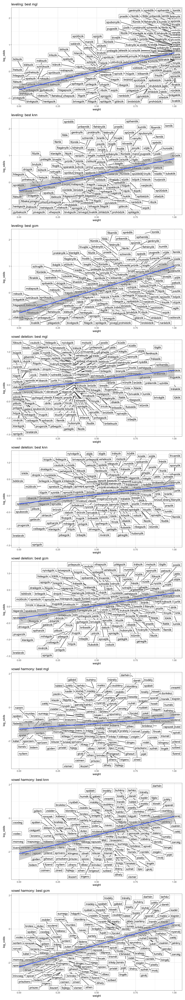

Evaluating an ensemble model of phonological categorisation on three
variable morphological patterns in Hungarian
================
Rácz, Péter
2024-04-22

In this readme, we go through a way of measuring distance between words
based on natural classes that are, in turn, based on segmental
similarity. Then we use this and other distances in three categorisation
models to predict what people do in a Wug task with three variable
patterns of Hungarian morphology.

There are three patterns of variation (see References for details):

- *leveling*: verb variation between `-k` and `-m` in the 1sg.indef of
  verbs
- *vowel deletion*: verb variation between `CC.V+suffix` and
  `CVC.suffix` in a range of verbs, here focussing on the pl.indef
- *vowel harmony*: noun variation between front vowel and back vowel
  suffixes in bisyllabic noun stems with a semi-transparent second vowel
  (`[e]` or `[é]`)

There are three models:

- K Nearest Neighbours
- the Generalised Context Model
- an R-based, specific implementation of the Minimal Generalisation
  Learner

There are three word distance measures:

- Levenshtein distance / edit distance
- Phonological distance, based on segmental distance across aligned word
  forms
- Jaccard distance

The Minimal Generalisation Learner uses edit distance between strings
and generally works very differently from the Generalised Context Model
and the K-nearest Neighbours Model.

## Table of contents

In this readme, we will:

1.  Generate natural classes from a language’s phonological feature
    matrix
2.  Generate segment-distances from the natural classes
3.  Generate word-distances from the segment-distances using a word
    aligner
4.  Generate categories from the word distances and an algorithm in the
    training data and apply these to test data
5.  Generate generalised overlaps/rules from the words in the training
    data and see how these rules predict the test data

## Quick start

We do this below but in detail:

``` r
# a. generate natural classes

nch = h |>
  generateNaturalClasses()

# b. build distance table for pairwise segment comparisons

lookup_h = buildDistTable(h, nch) |>
  addLevenshtein()

# c. align test and target words to find best phon-based alignment, here, for the 'lakok/lakom' variation. this takes ages.

alignments_lakok = runLookup(test_l,training_l,lookup_h)

# d. get distance based on best alignment, here, for lakok. join back with training data.

word_distance_lakok = alignments_lakok |>
  dplyr::distinct(test,training,total_dist) |>
  dplyr::rename(phon_dist = total_dist) |>
  dplyr::left_join(training, join_by('training' == 'string'))

# e. use the paired data to fit some sort of a phon distance based learning model, here, a KNN

# you can use a wrapper function to do a-e:
KNNwrapper(test = test, training = training, feature_matrix = fm, my_distance = 'phon', my_s = .1, my_k = 3, my_p = 1)

# you can use the wrapper function to use some other distance and skip the whole alignment bit:
KNNwrapper(test = test, training = training, feature_matrix = fm, my_distance = 'jaccard', my_s = .1, my_k = 3, my_p = 1)

# you can also use the wrapper function to use the mgl (see code/run_mgl.r):
mgl(training, alpha_upper = .75, alpha_lower = .75)
# this gives you rules and then you can use them to predict the test data
```

## 1. Generate natural classes

The feature matrix was adapted from Siptár and Törkenczy (2000). “ṯ”,
“ḏ”, and “ṉ” are the palatal stops. “c” is “ts”. Here is a sample of the
feature matrix.

| segment | cons | son | cont | labial | coronal | anterior | dorsal | lateral | voice | delrel | seg | long | open1 | open2 |
|:--------|:-----|:----|:-----|:-------|:--------|:---------|:-------|:--------|:------|:-------|:----|:-----|:------|:------|
| s       | \+   | \-  | \+   |        | \+      | \+       |        |         | \-    |        | \+  |      |       |       |
| ḏ       | \+   | \-  | \-   |        | \+      | \-       |        |         | \+    |        | \+  |      |       |       |
| k       | \+   | \-  | \-   |        |         |          | \+     |         | \-    |        | \+  |      |       |       |
| z       | \+   | \-  | \+   |        | \+      | \+       |        |         | \+    |        | \+  |      |       |       |
| á       | \-   |     | \+   | \-     | \-      |          | \+     |         |       |        | \+  | \+   | \+    | \+    |
| ṉ       | \+   | \+  | \-   |        | \+      | \-       |        |         | \+    |        | \+  |      |       |       |
| n       | \+   | \+  | \-   |        | \+      | \+       |        |         | \+    |        | \+  |      |       |       |
| ú       | \-   |     | \+   | \+     | \-      |          | \+     |         |       |        | \+  | \+   | \-    | \-    |
| o       | \-   |     | \+   | \+     | \-      |          | \+     |         |       |        | \+  | \-   | \-    | \+    |
| e       | \-   |     | \+   | \-     | \+      |          | \-     |         |       |        | \+  | \-   | \+    | \+    |

Table: Sample of the phonological feature matrix

We turn it into underspecified natural class descriptions following
Albrighty and Hayes (2003) and Frisch, Pierrehumbert, and Broe (2004).

``` r
nch = h |>
  generateNaturalClasses()

write_tsv(nch, 'dat/natural_classes/siptar_torkenczy_toth_racz_hungarian_nc.tsv')
```

Here’s a sample of what the output looks like.

| feature_bundle                       | segments                                                            |
|:-------------------------------------|:--------------------------------------------------------------------|
| \[+cont, +anterior\]                 | s, z, l, r                                                          |
| \[+son, -cont\]                      | m, n, ṉ                                                             |
| \[+labial, -coronal, +open2\]        | o, ó                                                                |
| \[+cons\]                            | p, b, f, v, m, t, d, s, z, c, n, l, r, ṯ, ḏ, š, ž, č, ṉ, j, k, g, h |
| \[+labial, +coronal, -long, +open2\] | ö                                                                   |
| \[+labial, +coronal, -long, -open2\] | ü                                                                   |
| \[+open2\]                           | a, á, e, é, o, ó, ö, ő                                              |
| \[+labial, -coronal\]                | o, ó, u, ú                                                          |
| \[+voice, -delrel\]                  | d                                                                   |
| \[+anterior\]                        | t, d, s, z, c, n, l, r, ṯ                                           |

Table: Sample of the natural classes

## 2. Generate segment-distances from the natural classes

We use the natural classes to calculate phonological distances between
segments and also add edit distances for the sake of completeness: Any
segment vs any other segment has a phonological distance of 0-1, any
segment vs nothing has a phonological distance of 1.

``` r
lookup_h = buildDistTable(h, nch) |>
  addLevenshtein()

write_tsv(lookup_h, 'dat/segmental_distances/siptar_torkenczy_toth_racz_hungarian_dt.tsv')
```

Here’s a sample of what the output looks like.

| segment1 | segment2 | dist |
|:---------|:---------|-----:|
| š        | í        | 0.90 |
| ú        | ű        | 0.58 |
| č        | d        | 0.74 |
| ḏ        | p        | 0.86 |
| d        | ṉ        | 0.73 |
| i        | ú        | 0.87 |
| b        | h        | 0.85 |
| i        | é        | 0.76 |
| l        | ṉ        | 0.80 |
| e        | i        | 0.60 |

Table: Sample of the segmental distances

Distances between objects can be turned into a map of objects using
multidimensional scaling. Here’s what segmental distances look like in
the output as a map, across 3 dimensions.

<!-- -->

These three dimensions don’t exactly match to place or manner of
articulation, but we can recognise patterns. The top left panel splits
segments into vowels, non-coronals, coronal stops, and coronal
continuants. The top right panel shows velars, labials, and coronals,
mixing in the vowels, which share place of articulation features with
the consonants. The bottom right panel splits vowels from consonants,
and shows consonants in a continuum from labial and dorsal to coronal.

## 3. Generate word-distances from the segment-distances using a word aligner

We want to find the alignment between word 1 and word 2 where the
pairwise comparison of their segments yields the smallest total
distance. We can skip segment slots. This is a good alignment between
“asztrál” \[astra:l\] (astral) and “osztály” \[osta:j\] (class):

    a s t r á l
    o s t   á j 

This isn’t:

    a s t r á l
    o s t á j 

For each word pair, we do every conceivable alignment and pick the one
with the shortest total distance. This will be the pair with the best
alignment. This process is resource intensive. To run it, we need the
two words and the lookup table generated in step 2. The resulting table
shows the two strings in their bestalignment (col 1 and 2), the
distances between the segments (dist, this is 0 for identical segments
and 1 for deletion / insertion) and the total phonological distance
(which is the same value for the whole alignment).

``` r
alignWords('astrál', 'ostáj', lookup_h) %>% 
  kable(digits = 2, caption = 'Table: Sample alignment 1')
```

| segment1 | segment2 | dist | phon_dist |
|:---------|:---------|-----:|----------:|
| a        | o        | 0.62 |      2.07 |
| s        | s        | 0.00 |      2.07 |
| t        | t        | 0.00 |      2.07 |
| r        |          | 1.00 |      2.07 |
| á        | á        | 0.00 |      2.07 |
| l        | j        | 0.45 |      2.07 |

Table: Sample alignment 1

Some of this is less intuitive, because sometimes the best alignment is
ceteris paribus not the one you’d expect, see:

``` r
alignWords('astalka', 'astrál', lookup_h) %>% 
  kable(digits = 2, caption = 'Table: Sample alignment 2')
```

| segment1 | segment2 | dist | phon_dist |
|:---------|:---------|-----:|----------:|
| a        | a        | 0.00 |      2.97 |
| s        | s        | 0.00 |      2.97 |
| t        | t        | 0.00 |      2.97 |
| a        |          | 1.00 |      2.97 |
| l        | r        | 0.12 |      2.97 |
| k        | á        | 0.92 |      2.97 |
| a        | l        | 0.94 |      2.97 |

Table: Sample alignment 2

Apparently comparing the final `ka$` to the final `ál$` is a better
bargain than skipping 1 segment and gaining a penalty of 1 and then
comparing `ka $` to `ál$`.

This is based on Albright and Hayes (2003) and Dawdy-Hesterberg and
Pierrehumbert (2014).

## 4. Generate categories from the word distances and an algorithm

I have some training and test data for three variable patterns in
Hungarian. See the preprint for details.

1.  ‘lakok/lakom’ or *leveling* (inflectional): 1sg.indef variation:
    lakok/lakom (“I live”)
2.  ‘cselekszenek/cselekednek’ or *vowel deletion* (inflectional): in
    various verbal paradigm slots, including the 1/2/3pl.indef:
    cselekszenek/cselekednek (“they act”)
3.  ‘hotelban/hotelben’ or *vowel harmony* (declensional): in back
    vowel + \[eé\] stems: hotelban/hotelben (“in the hotel”)

- training data come from Hungarian webcorpus 2.
- test data come from a wug task where people responded to prompts in a
  forced-choice format. about 30 people responded to each prompt. they
  came from a student pool. See the Rácz & Lukács preprint for details.
  (The preprint only talks about 1 and 2 right now, but it covers
  methods and ethics for 3 as well.)

Training data look like this:

| variation      | base       | lemma_freq_corrected | string   | category |
|:---------------|:-----------|---------------------:|:---------|:---------|
| leveling       | pereskedik |                 7520 | perešked | high     |
| leveling       | kerekezik  |                 7868 | kerekez  | high     |
| leveling       | lelkesedik |                33550 | lelkešed | low      |
| leveling       | tornázik   |                32996 | tornáz   | low      |
| vowel deletion | hibádzik   |                 5785 | hibádz   | high     |
| vowel deletion | sejlik     |                 8848 | šejl     | high     |
| vowel deletion | merevedik  |                 5585 | mereved  | low      |
| vowel deletion | házasodik  |                48749 | házašod  | low      |
| vowel harmony  | szlovén    |               111340 | slovén   | high     |
| vowel harmony  | alélt      |                 2710 | alélt    | high     |
| vowel harmony  | charter    |                 9782 | charter  | low      |
| vowel harmony  | csapszék   |                 1650 | čapsék   | low      |

Table: Sample of the training data

The category labels are engineered.

For ‘cselekszenek/cselekednek’, verbs that end in `CCik$` are the “high”
category and verbs that end in `CVCik$` are the “low” category. (This is
slightly more complicated: some `CVCik$` verbs act like `CCik$` verbs
with vowel-initial suffixes and these were put in the `CCik$` category.)

For ‘hotelban/hotelben’, the two variants are back or front vowel
variants of the same suffix (e.g. “ban/ben”, “in”) – but these vary
across a range of suffixes, the suffixes themselves have different total
frequencies, so I fit a mixed model predicting `cbind(freq1,freq2)` in
the corpus with a stem and suffix intercept. I then extracted the stem
random effects and split the distribution across the median. This is the
“high” and “low” category. Nouns that prefer back suffixes are in the
“high” category and nouns that prefer front suffixes are in the “low”
category.

For ‘lakok/lakom’, there is one exponent that varies and you can count
the two forms (lakok, lakom) per verb and calculate log odds, then split
the distribution across the median.

Training data was restricted to exclude less frequent forms and very
long forms.

Test data look like this:

| variation      | base                   | variant1    | variant2    | resp1 | resp2 | string  |
|:---------------|:-----------------------|:------------|:------------|------:|------:|:--------|
| leveling       | tínylik                | tínylok     | tínylom     |    16 |    10 | tíṉl    |
| leveling       | plágadzik              | plágadzok   | plágadzom   |    10 |    16 | plágadz |
| leveling       | ruslik                 | ruslok      | ruslom      |    21 |     8 | rušl    |
| leveling       | flátszik               | flátszok    | flátszom    |    11 |    18 | fláts   |
| leveling       | frilegszik             | frilegszek  | frilegszem  |    11 |    15 | frilegs |
| vowel deletion | gyihegzik / gyihegezik | gyihegzetek | gyihegeztek |    12 |    17 | ḏihegz  |
| vowel deletion | dirlik / dirozik       | dirlotok    | diroztok    |    13 |    13 | dirl    |
| vowel deletion | dabzik / dabozik       | dabzotok    | daboztok    |    13 |    16 | dabz    |
| vowel deletion | lájzik / lájozik       | lájzotok    | lájoztok    |    16 |    10 | lájz    |
| vowel deletion | brálamlik / brálamozik | brálamlanak | brálamoznak |    16 |    10 | brálaml |
| vowel harmony  | klajrén                | klajrénnak  | klajrénnek  |    17 |    12 | klajrén |
| vowel harmony  | nuhét                  | nuhétnál    | nuhétnél    |    12 |    15 | nuhét   |
| vowel harmony  | tarhéz                 | tarhézban   | tarhézben   |    21 |     6 | tarhéz  |
| vowel harmony  | kliszer                | kliszernál  | kliszernél  |     3 |    24 | kliser  |
| vowel harmony  | jutély                 | jutélynál   | jutélynél   |    19 |     8 | jutéj   |

Table: Sample of the test data

Test data were generated from corpus distributions using a syllabic
constituent-based ngram model. The resulting words are somewhat
onset-heavy (words in Hungarian can begin with `^sp` but maybe not this
often). Note that for ‘cselekszenek’, the Wug prompts had a CC and CVC
form, as both are possible (that being the point). We use the CC form to
calculate distances. This is a semi-arbitrary decision: variable verbs
have a CC and a CVC form. Stable CVC verbs never have a CC form. See the
preprint for details.

`string` is transcribed using a simple converter that maps Hungarian
orthography to IPA.

For each variation, you pair test and training words and calc word
distance. For the verbs (‘cselekszenek’, ‘lakok’ types) you can drop the
`ik$` ending as all verbs have it anyway.

``` r
# this legitimately takes a while.
# for stand-alone code go to code/run_alignment.r

# set up test and training data
testl = filter(test, variation == 'lakok/lakom')
trainingl = filter(training, variation == 'lakok/lakom')
testcs = filter(test, variation == 'cselekszenek/cselekednek')
trainingcs = filter(training, variation == 'cselekszenek/cselekednek')
testh = filter(test, variation == 'hotelban/hotelben')
trainingh = filter(training, variation == 'hotelban/hotelben')

# run the lookup for all variations
alignments_lakok = runLookup(testl,trainingl,lookup_h)
alignments_cselekszenek = runLookup(testcs,trainingcs,lookup_h)
alignments_hotelban = runLookup(testh,trainingh,lookup_h)

# write_tsv(alignments_lakok, 'dat/alignments/alignments_lakok.tsv')
# write_tsv(alignments_cselekszenek, 'dat/alignments/alignments_cselekszenek.tsv')
# write_tsv(alignments_hotelban, 'dat/alignments/alignments_hotelban.tsv')
```

We now have best alignments for training : test data. These might be
useful someday, like if we want to build a rule-based learner. They look
like this. In the test col are three nonce words used in the Wug task.
In the training col are three aligned training words. Segment 1 and 2
show the test and training words broken up in segments, in their best
alignment. Dist shows segmental distances (this is the same as the table
above). Total dist shows the total distance for the alignment, which is
the sum of segmental distances.

This is just three examples. Note that we deleted the verbal “ik” ending
because that’s the same everywhere and this speeds up computation.

| test   | training | segment1 | segment2 | dist | phon_dist |
|:-------|:---------|:---------|:---------|-----:|----------:|
| narádz | bábáškod | n        | b        | 0.84 |      5.84 |
| narádz | bábáškod | a        | á        | 0.58 |      5.84 |
| narádz | bábáškod | r        | b        | 0.94 |      5.84 |
| narádz | bábáškod | á        | á        | 0.00 |      5.84 |
| narádz | bábáškod |          | š        | 1.00 |      5.84 |
| narádz | bábáškod | d        | k        | 0.84 |      5.84 |
| narádz | bábáškod |          | o        | 1.00 |      5.84 |
| narádz | bábáškod | z        | d        | 0.63 |      5.84 |
| šalárz | kérked   | š        | k        | 0.86 |      4.21 |
| šalárz | kérked   | a        | é        | 0.81 |      4.21 |
| šalárz | kérked   | l        | r        | 0.12 |      4.21 |
| šalárz | kérked   | á        | k        | 0.92 |      4.21 |
| šalárz | kérked   | r        | e        | 0.88 |      4.21 |
| šalárz | kérked   | z        | d        | 0.63 |      4.21 |
| streml | vesőd    | s        | v        | 0.87 |      5.11 |
| streml | vesőd    | t        | e        | 0.95 |      5.11 |
| streml | vesőd    | r        | s        | 0.64 |      5.11 |
| streml | vesőd    | e        | ő        | 0.79 |      5.11 |
| streml | vesőd    | m        | d        | 0.86 |      5.11 |
| streml | vesőd    | l        |          | 1.00 |      5.11 |

Example alignments

What we actually need is the total phonological distances.

The final result looks like this. We have total phonological distance,
based on best alignment, between each test word and each training word
in each variation pattern.

| variation      | test    | training  | phon_dist |
|:---------------|:--------|:----------|----------:|
| leveling       | špilágz | sándékoz  |      5.38 |
| leveling       | frodl   | hüledez   |      4.23 |
| leveling       | livakl  | diétáz    |      4.37 |
| leveling       | trádl   | perešked  |      6.28 |
| leveling       | pribags | kertésked |      6.80 |
| vowel deletion | špibegl | hazudoz   |      6.12 |
| vowel deletion | frakl   | vágtáz    |      4.84 |
| vowel deletion | bejz    | töpöröd   |      5.25 |
| vowel deletion | döjl    | taṉáz     |      3.78 |
| vowel deletion | špoṉl   | lakmároz  |      6.35 |
| vowel harmony  | trodéj  | korvett   |      5.38 |
| vowel harmony  | hivép   | honvéd    |      2.71 |
| vowel harmony  | klošét  | šábes     |      4.68 |
| vowel harmony  | gúden   | šakter    |      4.02 |
| vowel harmony  | tranék  | notes     |      4.53 |

Table: Word distances for nonce words in the Wug task and their aligned
training words.

## 4. Modelling

The nonce words got variable A or B responses in the Wug task and have a
specific similarity to existing words in two categories: A and B. A and
B are different for each word type (‘cselekszenek’, ‘hotelban’,
‘lakok’). We want to see whether similarity to existing words predicts
variable responses.

Training categories are:

- lakok/lakom or *leveling*: variable verbs above the median log odds of
  k/m in the corpus are high, others are low
- cselekszenek/cselekednek or *vowel deletion*: stable `CCik$` verbs are
  high, stable `CVCik$` verbs are low
- hotelban/hotelben or *vowel harmony*: we aggregated over multiple
  suffixed variants to have a random intercept for each stem, those over
  the median of random intercepts are high, others low

Training sets were also slightly culled to include only more frequent
verbs and shorter verbs. (see preprint and `training_preprocessor.R` for
details).

The end result looks like this. This is distances between test words and
training words and responses to test words and training word category.

| variation      | test_label             | training_label | category | phon_dist |
|:---------------|:-----------------------|:---------------|:---------|----------:|
| leveling       | flagánylik             | vitorlázik     | high     |      6.56 |
| leveling       | narjárzik              | távolodik      | high     |      5.64 |
| leveling       | hűgzik                 | szomorkodik    | low      |      6.73 |
| leveling       | sztremlik              | kardoskodik    | low      |      7.39 |
| vowel deletion | pilégszik / pilégedik  | gyülemlik      | high     |      3.32 |
| vowel deletion | fröjzik / fröjözik     | alszik         | high     |      3.53 |
| vowel deletion | gyihegzik / gyihegezik | hamarkodik     | low      |      6.39 |
| vowel deletion | klihaslik / klihasozik | fogadkozik     | low      |      6.99 |
| vowel harmony  | narem                  | ankét          | high     |      4.19 |
| vowel harmony  | ítens                  | másként        | high     |      4.89 |
| vowel harmony  | vodec                  | popper         | low      |      3.53 |
| vowel harmony  | zopély                 | bagett         | low      |      4.70 |

Table: Word distances for nonce words in the Wug task and their aligned
training words, with training word category and test word response log
odds (large log odds: lot of “high” responses).

### K-Nearest Neighbour

We categorise test words based on similarity with training words using a
K-Nearest Neighbours algorithm. The algorithm uses a pre-specified
distance measure and calculates similarity as `exp(d)`, mostly to be in
line with the GCM, though this makes little practical difference.

We try `k = [1,3,5,7,15]` and
`dist = [edit distance, jaccard distance, phonological distance]`. Edit
distance tallies up the number of edits needed to get from Word A to
Word B. Jaccard distance is the set size of the intersect of segments in
Word A and Word B divided by the set size of the union of segments in
Word A and Word B. Phonological distance is the whole setup above.

A regular old KNN compares the target word to the nearest n words and
counts category labels. So if this is 3 words and they are “high”,
“high”, “low”, the target word is categorised as “high”. My KNN outputs
the mean category label, which, in the example, would be .66.

For each test word, we get a KNN prediction for each parameter
combination. Then we fit a GLM that predicts how people “voted” on the
word (like, 15 picked variant A and 20 picked variant B) from the
model’s category weight. We then grab the term “category: high” from the
model and take the est, std error, z value (statistic), and p value.
These express how well the KNN weights predict whether more people
picked variant A or B. We compare models using the z value (statistic),
which favours the least noise over the largest effect.

``` r
# set up parameters
my_parameters_1 = crossing(
  var_p = 1,
  var_k = c(1,2,3,5,7,15),
  var_s = 1,
  distance_type = c('edit','jaccard','phon'),
  variation = c('lakok/lakom','hotelban/hotelben','cselekszenek/cselekednek')
)

# run 54 models, parallelised, add prediction tibbles to each model
my_knns = my_parameters_1 %>% 
  mutate(
    knn = furrr::future_pmap(list(variation,distance_type,var_p,var_s,var_k), ~ wrapKNN(
      dat = word_distance,
      my_variation = ..1,
      distance_type = ..2,
      var_p = ..3,
      var_s = ..4,
      var_k = ..5
      )
    )
  )

# combine with test and calc accuracy
my_knns %<>% 
  mutate(
    knn2 = map(knn,combineWithTest),
    accuracy = map(knn2,testAccuracy)
  )

my_knns2 = my_knns %>% 
  select(-knn,-knn2) %>% 
  unnest(accuracy)
```

<!-- -->

| variation      | var_k | distance_type | estimate | std.error | statistic | sig    |
|:---------------|------:|:--------------|---------:|----------:|----------:|:-------|
| vowel deletion |    15 | phon          |     0.61 |      0.14 |      4.29 | \*\*\* |
| vowel harmony  |    15 | jaccard       |     2.81 |      0.19 |     14.91 | \*\*\* |
| leveling       |     7 | edit          |     1.23 |      0.13 |      9.20 | \*\*\* |

Table: Best KNN model for each variation.

All three models can explain some variation in the test data. The ‘vowel
deletion’ model uses phonological distance and the largest k, k=15. For
‘vowel harmony’, the best model also uses the largest k and jaccard
distance. For ‘leveling’, the best model uses k=7 and edit distance.

We can look at the best model for each segment distance type and
variation.

| variation      | var_k | distance_type | estimate | std.error | statistic | sig    |
|:---------------|------:|:--------------|---------:|----------:|----------:|:-------|
| leveling       |     7 | edit          |     1.23 |      0.13 |      9.20 | \*\*\* |
| leveling       |    15 | jaccard       |     0.80 |      0.22 |      3.60 | \*\*\* |
| leveling       |    15 | phon          |     1.44 |      0.17 |      8.31 | \*\*\* |
| vowel deletion |     7 | edit          |     0.41 |      0.12 |      3.36 | \*\*\* |
| vowel deletion |     2 | jaccard       |     0.31 |      0.08 |      3.92 | \*\*\* |
| vowel deletion |    15 | phon          |     0.61 |      0.14 |      4.29 | \*\*\* |
| vowel harmony  |    15 | edit          |     3.03 |      0.21 |     14.37 | \*\*\* |
| vowel harmony  |    15 | jaccard       |     2.81 |      0.19 |     14.91 | \*\*\* |
| vowel harmony  |    15 | phon          |     2.67 |      0.20 |     13.67 | \*\*\* |

Table: Best KNN model for each variation and distance type.

For ‘cselekszenek’ and ‘hotelban’, the models don’t differ much in
accuracy depending on distance. For ‘lakok’, jaccard distance is
markedly more terrible than the others. A K nearest-neighbour model
based on phonological distance between test and training words is nearly
on par with one based on edit distance, despite the extra information
available to the former: the edit distance between \[f\] and \[p\] is
the same as between \[f\] and \[u\], even though the former pair share
more natural classes and so have a smaller phonological distance.

### Generalised Context Model

The GCM calculates pairwise distances between the test word and target
words in each category (here A and B) using the formula
`$exp( - d / s )^p$` where s controls the trade-off between the number
of comparisons and test-training similarity, whereas p controls whether
we see an exponential decay (for p==1) or Gaussian decay (p==2) in the
similarity distance. Similarity to a training category is calculated by
getting the total similarity to the category and then dividing it by the
total similarity to all training forms.

We categorise test words based on similarity with training words using
the Generalised Context Model. We try `p = [1,2]`,
`s = [.1,.3,.5,.7,.9]` and edit distance, jaccard distance, and
phonological distance.

``` r
# we do the same thing as with the KNNs. If I did this once more I'd need to put it into a function! cheeky

# set up parameters
my_parameters_2 = crossing(
  var_p = c(1,2),
  var_s = c(.1,.3,.5,.7,.9),
  distance_type = c('edit','jaccard','phon'),
  variation = c('lakok/lakom','hotelban/hotelben','cselekszenek/cselekednek')
)

# run models
my_gcms = my_parameters_2 %>% 
  mutate(
    gcm = furrr::future_pmap(list(distance_type,variation,var_p,var_s), ~ wrapGCM(
      dat = word_distance,
      distance_type = ..1,
      my_variation = ..2,
      var_s = ..3,
      var_p = ..4
    ))
  )

# combine with test and calc accuracy
my_gcms %<>% 
  mutate(
    gcm2 = map(gcm,combineWithTest),
    accuracy = map(gcm2,testAccuracy)
  )

my_gcms2 = my_gcms %>% 
  select(-gcm,-gcm2) %>% 
  unnest(accuracy)
```

<!-- -->

| variation      | var_p | var_s | distance_type | estimate | std.error | statistic | sig    |
|:---------------|------:|------:|:--------------|---------:|----------:|----------:|:-------|
| vowel deletion |     2 |   0.3 | edit          |    36.23 |      6.23 |      5.81 | \*\*\* |
| vowel harmony  |     2 |   0.3 | jaccard       |   499.57 |     26.32 |     18.98 | \*\*\* |
| leveling       |     2 |   0.9 | phon          |    27.97 |      2.40 |     11.66 | \*\*\* |

Table: Best GCM model for each variation.

Again, the categorisation models account for some variation across test
words in all three variable patterns. For ‘vowel deletion’, the best
model uses edit distance and an exponential distance metric. For
‘leveling’, the best model uses phonological distance and the
exponential metric. For ‘vowel haromy’ it, again, uses jaccard distance.
Note that if the GCM uses Jaccard distance, the s parameter does
nothing. This is likely because Jaccard distances are distributed
completely differently than either Levenshtein or phonological
distances.

| variation      | var_p | var_s | distance_type | estimate | std.error | statistic | sig    |
|:---------------|------:|------:|:--------------|---------:|----------:|----------:|:-------|
| leveling       |     1 |   0.9 | edit          |     7.71 |      0.73 |     10.62 | \*\*\* |
| leveling       |     2 |   0.1 | jaccard       |   856.03 |    147.10 |      5.82 | \*\*\* |
| leveling       |     2 |   0.9 | phon          |    27.97 |      2.40 |     11.66 | \*\*\* |
| vowel deletion |     2 |   0.3 | edit          |    36.23 |      6.23 |      5.81 | \*\*\* |
| vowel deletion |     1 |   0.9 | jaccard       |    44.52 |      9.53 |      4.67 | \*\*\* |
| vowel deletion |     1 |   0.9 | phon          |     3.56 |      0.68 |      5.22 | \*\*\* |
| vowel harmony  |     2 |   0.7 | edit          |    24.14 |      1.31 |     18.48 | \*\*\* |
| vowel harmony  |     2 |   0.3 | jaccard       |   499.57 |     26.32 |     18.98 | \*\*\* |
| vowel harmony  |     1 |   0.9 | phon          |    12.00 |      0.70 |     17.21 | \*\*\* |

Table: Best GCM model for each variation and distance type.

## 5. The Minimal Generalisation Learner

The Minimal Generalisation Learner looks for overlapping alternations in
the training data and tries to generalise these. It was written in R
following the steps in Albright and Hayes (2003) and, where they refer
to it, Mikheev (1997). The Minimal Generalisation Learner looks for
input-output alternations of the format `A -> B` in context `C _ D` and
then tries to generalise these.

| no  | input        | output       | rule    | context |
|:----|:-------------|:-------------|:--------|:--------|
| 1   | abc\_\_x\_\_ | abc\_\_y\_\_ | x -\> y | abc \_  |
| 2   | bbc\_\_x\_\_ | bbc\_\_y\_\_ | x -\> y | bbc \_  |
| 3   | adc\_\_x\_\_ | adc\_\_y\_\_ | x -\> y | adc \_  |
| 4   | aec\_\_x\_\_ | aec\_\_z\_\_ | x -\> z | aec \_  |

For the input-output pairs in the table above, we observe `x` turning
into `y` or `z` word-finally. We can consolidate examples 1-2 to rule
(i): `x -> y / bc _` and example 1-3 to rule (ii): `x -> y / c _`. Note
that example (4) matches the structural description of rule (ii) but the
rule does not apply to it. So rule (i) has a scope of 2 examples and
matches 2 of these, while rule (ii) has a scope of 4 and matches 3. Rule
(i) is more *reliable* than rule (ii) as it applies to more of its
context examples but rule (ii) has more examples in its context
altogether.

We can adjust the reliability of our rules based on how many forms they
apply to. This will express the notion that rule (i) is more reliable
but more limited than rule (ii). We can also adjust rule reliability
based on whether some rules do the work of other rules. In our example,
rule (ii) is redundant in examples 1-2 where rule (i) does all its work.
We can reflect this by adjusting down how much we confide in rule (ii).

The original implementation of the Minimal Generalisation Learner can
use phonological distance to create generalised contexts. The present
implementation only looks for segment-to-segment matches. Hungarian
verbs tend to have strong templatic effects with many derivational and
pseudo-derivational endings. These can have predictive effects on
inflectional variation. The current implementation can find these.

First, we hard-wire phonological variation in our dataset because we
want the minimal generalisation learner to focus on the morphology
(-k/-m, CC/CVC, -front/-back) instead of the phonology. (The K-nearest
neighbour model and the generalised context model only had to pick
between two variants, and the minimal generalisation learnerr shouldn’t
have a much harder time than these.)

Here are the transformed input-output pairs in the training sets:

| variation      | base       | category | suffix | input      | output      |
|:---------------|:-----------|:---------|:-------|:-----------|:------------|
| leveling       | szarakodik | high     | 3sg    | sarakodiK  | sarakodVk   |
| leveling       | préselődik | low      | 3sg    | préšelődiK | préšelődVm  |
| vowel deletion | bomlik     | high     | nek    | bomliK     | bomolnVk    |
| vowel deletion | pirosodik  | low      | nek    | pirošodiK  | pirošodnVk  |
| vowel deletion | hajlik     | high     | tek    | hajliK     | hajlVtVk    |
| vowel deletion | ringatózik | low      | tek    | ringatóziK | ringatóztVk |
| vowel deletion | borsódzik  | high     | ünk    | boršódziK  | boršódzVnk  |
| vowel deletion | tízóraizik | low      | ünk    | tízóraiziK | tízóraizVnk |
| vowel harmony  | klozet     | high     | ban    | klozet     | klozetban   |
| vowel harmony  | nonszensz  | low      | ban    | nonsens    | nonsensben  |
| vowel harmony  | sóder      | high     | nak    | šóder      | šódernak    |
| vowel harmony  | modell     | low      | nak    | modell     | modellnek   |
| vowel harmony  | borbély    | high     | nál    | borbéj     | borbéjnál   |
| vowel harmony  | makett     | low      | nál    | makett     | makettnél   |

Table: Training data, minimal generalisation learner

For ‘lakok’ and ‘cselekszenek’, vowel harmony is not relevant, so we
remove the final stem vowel and the linking vowel and the suffix vowel
and replace these with V. For ‘hotelban’, the suffix vowel is precisely
the point, so we keep it.

We transform test data the same way. We assign categories the same way
we did for the KNN and GCM training sets: if a test form does A a lot,
we assign it to A. If it does B a lot, we assign it to B.

| variation      | base                    | suffix | category | input     | output      |
|:---------------|:------------------------|:-------|:---------|:----------|:------------|
| leveling       | bihánylik               |        | high     | biháṉliK  | biháṉlVm    |
| leveling       | aglik                   |        | low      | agliK     | aglVm       |
| vowel deletion | brálamlik / brálamozik  | nek    | high     | brálamliK | brálamoznVk |
| vowel deletion | bratárzik / bratározik  | nek    | low      | bratárziK | bratároznVk |
| vowel deletion | brözlik / brözözik      | tek    | high     | brözliK   | brözöztVk   |
| vowel deletion | bribékszik / bribékedik | tek    | low      | bribéksiK | bribékedtVk |
| vowel deletion | bejzik / bejezik        | ünk    | high     | bejziK    | bejezVnk    |
| vowel deletion | drilarzik / drilarozik  | ünk    | low      | drilarziK | drilarozVnk |
| vowel harmony  | brotes                  | ban    | high     | broteš    | brotešben   |
| vowel harmony  | bidem                   | ban    | low      | bidem     | bidemben    |
| vowel harmony  | brágéd                  | nak    | high     | brágéd    | brágédnek   |
| vowel harmony  | bingéj                  | nak    | low      | bingéj    | bingéjnek   |
| vowel harmony  | brukész                 | nál    | high     | brukés    | brukésnél   |
| vowel harmony  | braszenc                | nál    | low      | brasenc   | brasencnél  |

Table: Test data, minimal generalisation learner

We fit the model separately on every variable suffix type so it doesn’t
need to distinguish those either. There are three variable suffixes for
‘cselekszenek’ and ‘hotelban’ and only one for ‘lakok’. As noted
earlier, the minimal generalisation learner has two parameters, one
penalising rules that cover fewer versus more input-output pairs in the
training (as in i-ii in the examples above) and one penalising rules
that have subrules that do most of the work for them (also as in i
versus ii in the examples above). We try \[.25,.5,.75,.9\] for both of
these parameters (for details see code/run_mgl.r and code/mgl.r and
code/test_mgl.r). We fit the minimal generalisation learner on the
suffix sets and then combine all rules for each variation pattern. Here
are ten random rules for ‘leveling’, with no guidance:

| rule                 | scope | hits | reliability | alpha_lower | lower_confidence_limit | alpha_upper | impugned_lower_confidence_limit | some_examples                                                 | some_exceptions                                             |
|:---------------------|------:|-----:|------------:|------------:|-----------------------:|------------:|--------------------------------:|:--------------------------------------------------------------|:------------------------------------------------------------|
| iK → Vk / kod\_\_#   |    68 |   17 |        0.25 |        0.25 |                   0.24 |        0.25 |                            0.27 | bohóckodik, bámészkodik, finomkodik, hangoskodik, haverkodik  | akaszkodik, bizakodik, bosszankodik, bábáskodik, bátorkodik |
| iK → Vm / étkez\_\_# |     2 |    2 |        1.00 |        0.25 |                   0.72 |        0.25 |                            0.72 |                                                               |                                                             |
| iK → Vm / kez\_\_#   |    28 |   16 |        0.57 |        0.25 |                   0.54 |        0.25 |                            0.45 | felejtkezik, jelentkezik, következik, rendelkezik, segédkezik | cikkezik, ellenkezik, emlékezik, fegyverkezik, feledkezik   |
| iK → Vm / őšöd\_\_#  |     2 |    2 |        1.00 |        0.25 |                   0.72 |        0.25 |                            0.72 |                                                               |                                                             |
| iK → Vk / porod\_\_# |     2 |    2 |        1.00 |        0.25 |                   0.72 |        0.25 |                            0.72 |                                                               |                                                             |

Table: Some rules for leveling

Each rule is in the “input ending -\> output ending / context” format.
Scope is the number of words in the training data that match the context
of the rule. Hits is the number of words that actually obey the rule.
Reliability is hits / scope. To put it very simply, the lower confidence
limit is the lower limit of our confidence of how well the rule would
work for many forms, adjusted by our alpha value for the lower
confidence limit. Impugned lower confidence limit is one of two things:
if, given an arbitrary alpha value for the upper confidence limit, the
rule does substantially more work than its sub-rules, it is the rule’s
own lower confidence limit. If the sub-rules do too much work, it’s the
best sub-rules upper confidence limit.

Here are ten rules for ‘vowel deletion’:

| rule                 | scope | hits | reliability | alpha_lower | lower_confidence_limit | alpha_upper | impugned_lower_confidence_limit | some_examples                                     | some_exceptions |
|:---------------------|------:|-----:|------------:|------------:|-----------------------:|------------:|--------------------------------:|:--------------------------------------------------|:----------------|
| iK → nVk / jod\_\_#  |     3 |    3 |           1 |         0.9 |                   0.32 |        0.25 |                            0.94 |                                                   |                 |
| iK → Vnk / áml\_\_#  |     2 |    2 |           1 |         0.9 |                  -0.83 |        0.25 |                           -0.83 |                                                   |                 |
| iK → nVk / ogóz\_\_# |     2 |    2 |           1 |         0.9 |                  -0.83 |        0.25 |                           -0.83 |                                                   |                 |
| iK → tVk / moz\_\_#  |     6 |    6 |           1 |         0.9 |                   0.72 |        0.25 |                            0.96 | fórumozik, hullámozik, hámozik, izmozik, malmozik |                 |
| iK → tVk / íz\_\_#   |     3 |    3 |           1 |         0.9 |                   0.32 |        0.25 |                            0.32 |                                                   |                 |

Table: Some rules for vowel deletion

Here are ten rules for ‘vowel harmony’:

| rule              | scope | hits | reliability | alpha_lower | lower_confidence_limit | alpha_upper | impugned_lower_confidence_limit | some_examples                          | some_exceptions                   |
|:------------------|------:|-----:|------------:|------------:|-----------------------:|------------:|--------------------------------:|:---------------------------------------|:----------------------------------|
| → ban / ér\_\_#   |     5 |    2 |        0.40 |        0.25 |                   0.34 |        0.25 |                            0.34 |                                        |                                   |
| → nak / et\_\_#   |     3 |    2 |        0.67 |        0.25 |                   0.52 |        0.25 |                            0.52 |                                        |                                   |
| → nak / ért\_\_#  |     2 |    2 |        1.00 |        0.25 |                   0.72 |        0.25 |                            0.72 |                                        |                                   |
| → ben / otel\_\_# |     3 |    2 |        0.67 |        0.25 |                   0.52 |        0.25 |                            0.52 |                                        |                                   |
| → nél / \_\_#     |    85 |   41 |        0.48 |        0.25 |                   0.47 |        0.25 |                            0.50 | amper, bankett, bojler, bróker, bunker | acél, allél, ankét, arzén, bakter |

Table: Some rules for vowel harmony

We choose the two parameters, alpha_upper and alpha_lower, using grid
search. Models are evaluated the following way. First, we match the
rules to the test words. For each test word, we have two outputs in the
forced choice task. We match each of these to rules generated by the
minimal generalisation learner and find the best rule for each output,
based on the impugned lower confidence limit, as seen in the table
below.

| base      | input       | variant | output      | rule              | impugned_lower_confidence_limit | some_examples                                         | some_exceptions                                      |
|:----------|:------------|:--------|:------------|:------------------|--------------------------------:|:------------------------------------------------------|:-----------------------------------------------------|
| aglik     | \#agliK#    | output1 | \#aglVk#    | iK → Vk / l\_\_#  |                            0.96 | botlik, csuklik, haldoklik, hanyatlik, telik          |                                                      |
| aglik     | \#agliK#    | output2 | \#aglVm#    | iK → Vm / \_\_#   |                            0.48 | aggódik, ajánlkozik, akaszkodik, alkudozik, alkuszik  | adakozik, adaptálódik, adódik, adósodik, alkudik     |
| bihánylik | \#biháṉliK# | output1 | \#biháṉlVk# | iK → Vk / l\_\_#  |                            0.96 | botlik, csuklik, haldoklik, hanyatlik, telik          |                                                      |
| bihánylik | \#biháṉliK# | output2 | \#biháṉlVm# | iK → Vm / \_\_#   |                            0.48 | aggódik, ajánlkozik, akaszkodik, alkudozik, alkuszik  | adakozik, adaptálódik, adódik, adósodik, alkudik     |
| bivejlik  | \#bivejliK# | output1 | \#bivejlVk# | iK → Vk / l\_\_#  |                            0.96 | botlik, csuklik, haldoklik, hanyatlik, telik          |                                                      |
| bivejlik  | \#bivejliK# | output2 | \#bivejlVm# | iK → Vm / \_\_#   |                            0.48 | aggódik, ajánlkozik, akaszkodik, alkudozik, alkuszik  | adakozik, adaptálódik, adódik, adósodik, alkudik     |
| bivégszik | \#bivégsiK# | output1 | \#bivégsVk# | iK → Vk / \_\_#   |                            0.49 | adakozik, adaptálódik, adódik, adósodik, alkudik      | aggódik, ajánlkozik, akaszkodik, alkudozik, alkuszik |
| bivégszik | \#bivégsiK# | output2 | \#bivégsVm# | iK → Vm / gs\_\_# |                            0.97 | betegszik, elégszik, gazdagszik, haragszik, melegszik |                                                      |
| brarlik   | \#brarliK#  | output1 | \#brarlVk#  | iK → Vk / l\_\_#  |                            0.96 | botlik, csuklik, haldoklik, hanyatlik, telik          |                                                      |
| brarlik   | \#brarliK#  | output2 | \#brarlVm#  | iK → Vm / \_\_#   |                            0.48 | aggódik, ajánlkozik, akaszkodik, alkudozik, alkuszik  | adakozik, adaptálódik, adódik, adósodik, alkudik     |

Table: Some predictions for leveling

We then take the best rule for each output and get an overall score by
dividing the impugned lower confidence of the rule for output 1 with the
sum of the impugned lower confidence of the rules for output 1 and 2. If
the Minimal Generalisation Learner finds no rule for output 1 for a test
word, the score will be 0 and vice versa. We can compare this score with
the responses given by the participants.

| base      | resp1 | resp2 | log_odds | mgl_score |
|:----------|------:|------:|---------:|----------:|
| aglik     |    12 |    15 |    -0.21 |      0.67 |
| bihánylik |    21 |     5 |     1.30 |      0.67 |
| bivejlik  |    18 |     8 |     0.75 |      0.67 |
| bivégszik |     7 |    22 |    -1.06 |      0.33 |
| brarlik   |    21 |     6 |     1.15 |      0.67 |
| brivegzik |     8 |    21 |    -0.89 |      0.50 |
| brobódzik |     9 |    18 |    -0.64 |      0.61 |
| brubzik   |    16 |    11 |     0.35 |      0.50 |
| brágaklik |    12 |    17 |    -0.33 |      0.67 |
| brüjlik   |    18 |     8 |     0.75 |      0.67 |

Table: Some scores for leveling

We use a generalised linear model predicting `cbind(resp1,resp2)` from
the model score to find the best model for each variable pattern. The
best model has the strongest predictor for score. This is the same as
what we did for the K-Nearest Neighbours Model and the Generalised
Context Model.

<!-- -->
The Minimal Generalisation Learner is able to predict participant
behaviour to some extent for all three patterns.

## The ensemble model

So what is the best at predicting what people will do with morphological
variation in a forced-choice task using nonce forms? The K-Nearest
Neighbours model, the Generalised Context Model, or the Minimal
Generalisation Learner?

| variation      | model | estimate | std.error | statistic | sig    | distance_type | var_s | var_p | alpha_lower | alpha_upper |
|:---------------|:------|---------:|----------:|----------:|:-------|:--------------|------:|------:|------------:|------------:|
| vowel deletion | GCM   |    36.23 |      6.23 |      5.81 | \*\*\* | edit          |   0.3 |     2 |             |             |
| vowel deletion | KNN   |     0.61 |      0.14 |      4.29 | \*\*\* | phon          |   1.0 |     1 |             |             |
| vowel deletion | mgl   |     6.51 |      1.32 |      4.92 | \*\*\* | edit          |       |       |        0.90 |        0.25 |
| vowel harmony  | GCM   |   499.57 |     26.32 |     18.98 | \*\*\* | jaccard       |   0.3 |     2 |             |             |
| vowel harmony  | KNN   |     2.81 |      0.19 |     14.91 | \*\*\* | jaccard       |   1.0 |     1 |             |             |
| vowel harmony  | mgl   |     2.49 |      0.47 |      5.28 | \*\*\* | edit          |       |       |        0.25 |        0.25 |
| leveling       | GCM   |    27.97 |      2.40 |     11.66 | \*\*\* | phon          |   0.9 |     2 |             |             |
| leveling       | KNN   |     1.23 |      0.13 |      9.20 | \*\*\* | edit          |   1.0 |     1 |             |             |
| leveling       | mgl   |     4.18 |      0.27 |     15.31 | \*\*\* | edit          |       |       |        0.25 |        0.25 |

Table: Best best Generalised Context Model (GCM), K-nearest neighbours
model (KNN), and Minimal Generalisation Learner (MGL) model for each
variation.

A lot is going on in this table. The table lists the best Generalised
Context Model (GCM), K-nearest neighbours model (KNN), and Minimal
Generalisation Learner (MGL) model for the three types of variation and
also lists model parameters: distance type (this is always edit distance
for the MGL), s and p (only applicable to the distance calculations of
the KNN and the GCM), and the alphas for the lower and upper confidence
intervals (only applicable to the rule generalisations of the MGL). The
table also lists the estimates, standard errors, and statistics that
express the predictive power of each model for participant responses.

For ‘vowel deletion’, the best model is the generalised context model,
which uses similarity to all training forms across categories. This
model calculates word distance using edit distance rather than aligned
phonological dissimilarity.

For ‘vowel harmony’, the best model is the generalised context model,
using jaccard distance.

For ‘leveling’, the best model is the minimal generalisation learner,
which by default uses segment-level similarity or edit distance to find
overlapping contexts across training words.

An equally important question is whether the models individually
contribute to explaining variation in the test data. To find out, we fit
three generalised linear models, each predicting the odds of resp1 and
resp2 in the three variable sets, using the best minimal generalisation
learner, generalised context model, and k-nearest neighbour model
predictions together. We scale predictors and check for collinearity.

| variation      | term        | estimate | std.error | statistic | conf.low | conf.high |
|:---------------|:------------|---------:|----------:|----------:|---------:|----------:|
| vowel deletion | (Intercept) |    -0.38 |      0.09 |     -4.45 |    -0.55 |     -0.22 |
| vowel deletion | mgl         |     0.36 |      0.14 |      2.60 |     0.09 |      0.64 |
| vowel deletion | knn         |    -0.11 |      0.21 |     -0.53 |    -0.52 |      0.30 |
| vowel deletion | gcm         |     0.69 |      0.22 |      3.22 |     0.27 |      1.12 |
| vowel harmony  | (Intercept) |    -2.26 |      0.12 |    -19.48 |    -2.49 |     -2.04 |
| vowel harmony  | mgl         |    -0.08 |      0.15 |     -0.57 |    -0.38 |      0.21 |
| vowel harmony  | knn         |    -0.12 |      0.26 |     -0.45 |    -0.64 |      0.40 |
| vowel harmony  | gcm         |     2.93 |      0.25 |     11.88 |     2.45 |      3.42 |
| leveling       | (Intercept) |    -1.04 |      0.10 |    -10.35 |    -1.24 |     -0.85 |
| leveling       | mgl         |     1.20 |      0.11 |     11.00 |     0.99 |      1.42 |
| leveling       | knn         |    -0.21 |      0.18 |     -1.19 |    -0.57 |      0.14 |
| leveling       | gcm         |     0.97 |      0.20 |      4.84 |     0.58 |      1.36 |

Ensemble model estimates for the three variable patterns.

The term estimates for generalised linear models predicting test
responses from the minimal generalisation learner, k-nearest neighbour,
and generalised context model scores across the three variable patterns
are above.

The k-nearest neighbour model does not explain model variation in any of
the three models. The rules identified by the minimal generalisation
learner contribute to variation in the two verbal patterns,
‘cselekszenek’ and ‘lakok’. For the latter, it is the most important
predictor. For the noun pattern, ‘hotelban’, the only relevant predictor
is the generalised context model.

We use a chi-square test of goodness of fit to check whether dropping
each term from each model significantly reduces model fit. The results
can be seen below.

| variation      | name |   Chi2 |    p |
|:---------------|:-----|-------:|-----:|
| vowel deletion | gcm  |  10.39 | 0.00 |
| vowel deletion | knn  |   0.28 | 0.60 |
| vowel deletion | mgl  |   6.77 | 0.01 |
| vowel harmony  | gcm  | 149.49 | 0.00 |
| vowel harmony  | knn  |   0.20 | 0.65 |
| vowel harmony  | mgl  |   0.32 | 0.57 |
| leveling       | gcm  |  23.56 | 0.00 |
| leveling       | knn  |   1.41 | 0.24 |
| leveling       | mgl  | 123.60 | 0.00 |

Likelihood tests for terms in the ensemble models.

This test supports the results above. The k-nearest neighbour model has
nothing to add. For the noun pattern, only the generalised context model
is relevant.

We can calculate McFadden’s pseudo R squared (1 - deviance / null
deviance) for each model.

| variation      | mcfadden’s r |
|:---------------|-------------:|
| vowel deletion |         0.15 |
| vowel harmony  |         0.35 |
| leveling       |         0.44 |

Table: McFadden’s pseudo R squared for the GLMs with the joint
predictions.

The ‘cselekszenek’ pattern is hard. Many different words vary in many
different ways in the lexicon and participants generalise this in a very
noisy way. For ‘hotelban’, form-based similarity is a reasonable measure
to differentiate words that prefer back or front vowel suffixes.

For ‘lakok’, we get a remarkably good result, for the cognitive
sciences. Here, both overall similarity and the derivational and
pseudo-derivational endings found by the minimal generalisation learner
are useful. It also helps that this pattern is restricted to one
paradigm slot, 1sg.indef and varies across many verbs consistently.

## Visualisations

The best model for each model type and variation. Model scores are
rescaled for each variation.

<!-- -->

## Discussion

People very clearly rely on the ambient language in making their wug
task judgements on these three variable patterns. We can tell because
the decisions they make for test words are partly based on the corpus
distributions of existing words that the test words look like. The
corpus is our best guess on the distributions in the ambient language.
This is all of course in line with the existing literature.

It is not the case that people compare training words to one or two
nearest neighbours and make their choices based on that. The best KNN
models use far more neighbours and even these are beaten by more general
models. Either all participants in the sample have a different nearest
neighbour in mind for each test word, which seems unlikely, or they
aggregate over a larger similarity space.

Phonological similarity is useful in the models, but it does not
necessarily beat other measures of similarity when calculating how much
a given test word looks like our training categories.

For verbs, the minimal generalisation learner is useful. This is because
the verbal inflection patterns are sensitive to derivational and
pseudo-derivational endings. The overlap finder can find these.

## References

The Wug task:

Berko, Jean. “The child’s learning of English morphology.” Word 14, no.
2-3 (1958): 150-177.

The natural class theory of segmental distances:

- Frisch, Stefan. Similarity and frequency in phonology. Northwestern
  University, 1996.
- Frisch, Stefan A., Janet B. Pierrehumbert, and Michael B. Broe.
  Similarity avoidance and the OCP. Natural language & linguistic theory
  22, no. 1 (2004): 179-228.

Word distances based on segmental distances:

- Albright, Adam, and Bruce Hayes. Rules vs. analogy in English past
  tenses: A computational/experimental study. Cognition 90, no. 2
  (2003): 119-161.
- Dawdy-Hesterberg, Lisa Garnand, and Janet Breckenridge Pierrehumbert.
  Learnability and generalisation of Arabic broken plural nouns.
  Language, cognition and neuroscience 29, no. 10 (2014): 1268-1282.

Features:

- Siptár, Péter, and Miklós Törkenczy. The phonology of Hungarian. OUP
  Oxford, 2000.

Training data:

- Rácz, Péter, and Ágnes Lukács. Morphological convergence and
  sociolinguistic salience: an experimental study. (2023)
  <https://osf.io/preprints/psyarxiv/zqwxv>.
- Nemeskey, Dávid Márk (2020). Natural Language Processing methods for
  Language Modeling. PhD thesis. Eötvös Loránd University.
  <https://hlt.bme.hu/en/resources/webcorpus2>

GCM, KNN:

- Nosofsky, Robert M. “The generalized context model: An exemplar model
  of classification.” Formal approaches in categorization (2011): 18-39.
- Peterson, Leif E. “K-nearest neighbor.” Scholarpedia 4, no. 2 (2009):
  1883.

MGL:

- Albright, Adam, and Bruce Hayes. “Modeling English past tense
  intuitions with minimal generalization.” In Proceedings of the ACL-02
  workshop on Morphological and phonological learning, pp. 58-69. 2002.
- Mikheev, Andrei. “Automatic rule induction for unknown-word guessing.”
  Computational Linguistics 23, no. 3 (1997): 405-423.

The three variable patterns:

- ‘cselekszenek/cselekednek’: Rácz, Péter, Péter Rebrus, and Miklós
  Törkenczy. “Attractors of variation in Hungarian inflectional
  morphology.” Corpus Linguistics and Linguistic Theory 17, no. 2
  (2021): 287-317.
- ‘hotelban/hotelben’: Hayes, Bruce, Péter Siptár, Kie Zuraw, and Zsuzsa
  Londe. “Natural and unnatural constraints in Hungarian vowel harmony.”
  Language (2009): 822-863.
- ‘lakok/lakom’: Rácz, Péter. “Frequency and prototypicality determine
  variation in the Hungarian verbal 1 SG. INDEF.” Acta Linguistica
  Academica. An International Journal of Linguistics (Until 2016 Acta
  Linguistica Hungarica) 66, no. 4 (2019): 601-620.

## Appendix

Predictions with test word labels:

<!-- -->
