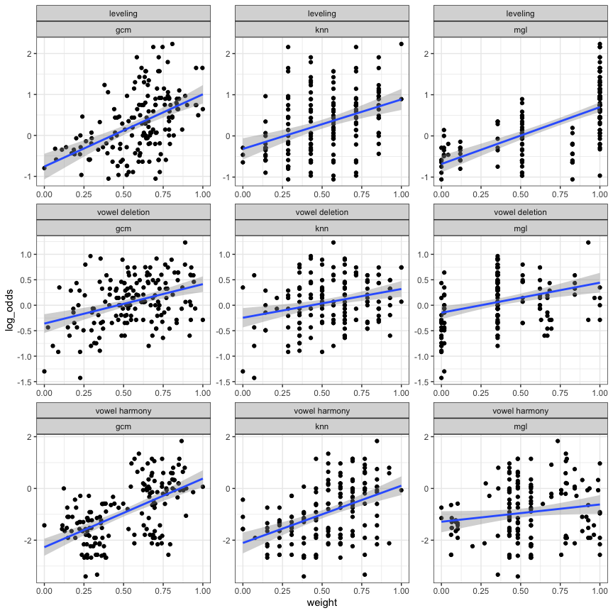

Phonological categorisation models for Hungarian morphological patterns
================
Rácz, Péter
2024-01-10

In this readme, we go through a way of measuring distance between words
based on natural classes that are, in turn, based on segmental
similarity. Then we use this and other distances in three categorisation
models to predict what people do in a Wug task with three variable
patterns of Hungarian morphology.

There are three patterns of variation (see References for details):

- verb variation between `-k` and `-m` in the 1sg.indef of verbs
- verb variation between `CC.V+suffix` and `CVC.suffix` in a range of
  verbs, here focussing on the pl.indef
- noun variation between front vowel and back vowel suffixes in
  bisyllabic noun stems with a semi-transparent second vowel (`[e]` or
  `[é]`)

There are three models:

- K Nearest Neighbours
- the Generalised Context Model
- the Tiny Overlap Finder, an R-based algorithm extremely heaviy
  influenced by the Minimal Generalisation Learner. (I don’t call this
  RMGL or something like that because the models work slightly
  differently)

There are three word distance measures:

- Levenshtein distance / edit distance
- Phonological distance, based on segmental distance across aligned word
  forms
- Jaccard distance

The Tiny Overlap Finder uses edit distance between strings and generally
works very differently from the other two.

## TOC

1.  Generate natural classes from a language’s phonological feature
    matrix
2.  Generate segment-distances from the natural classes
3.  Generate word-distances from the segment-distances using a word
    aligner
4.  Generate categories from the word distances and an algorithm in the
    training data and apply these to test data
5.  Generate generalised overlaps/rules from the words in the training
    data and see how these rules predict the test data

## Quick start

We do this below but in detail:

``` r
# a. generate natural classes

nch = h |>
  generateNaturalClasses()

# b. build distance table for pairwise segment comparisons

lookup_h = buildDistTable(h, nch) |>
  addLevenshtein()

# c. align test and target words to find best phon-based alignment, here, for the 'lakok/lakom' variation. this takes ages.

alignments_lakok = runLookup(test_l,training_l,lookup_h)

# d. get distance based on best alignment, here, for lakok. join back with training data.

word_distance_lakok = alignments_lakok |>
  dplyr::distinct(test,training,total_dist) |>
  dplyr::rename(phon_dist = total_dist) |>
  dplyr::left_join(training, join_by('training' == 'string'))

# e. use the paired data to fit some sort of a phon distance based learning model, here, a KNN

# you can use a wrapper function to do a-e:
KNNwrapper(test = test, training = training, feature_matrix = fm, my_distance = 'phon', my_s = .1, my_k = 3, my_p = 1)

# you can use the wrapper function to use some other distance and skip the whole alignment bit:
KNNwrapper(test = test, training = training, feature_matrix = fm, my_distance = 'jaccard', my_s = .1, my_k = 3, my_p = 1)

# you can also use the wrapper function to use the TOF (see code/run_tof.r):
tof(training, alpha_upper = .75, alpha_lower = .75)
# this gives you rules and then you can use them to predict the test data
```

## 1. Generate natural classes

The feature matrix was adapted from Siptár and Törkenczy (2000). “ṯ”,
“ḏ”, and “ṉ” are the palatal stops. “c” is “ts”. Here is a sample of the
feature matrix.

| segment | cons | son | cont | labial | coronal | anterior | dorsal | lateral | voice | delrel | seg | long | open1 | open2 |
|:--------|:-----|:----|:-----|:-------|:--------|:---------|:-------|:--------|:------|:-------|:----|:-----|:------|:------|
| ő       | \-   |     | \+   | \+     | \+      |          | \-     |         |       |        | \+  | \+   | \-    | \+    |
| m       | \+   | \+  | \-   | \+     |         |          |        |         | \+    |        | \+  |      |       |       |
| b       | \+   | \-  | \-   | \+     |         |          |        |         | \+    |        | \+  |      |       |       |
| v       | \+   |     | \+   | \+     |         |          |        |         | \+    |        | \+  |      |       |       |
| c       | \+   | \-  | \-   |        | \+      | \+       |        |         | \-    | \+     | \+  |      |       |       |
| ṉ       | \+   | \+  | \-   |        | \+      | \-       |        |         | \+    |        | \+  |      |       |       |
| g       | \+   | \-  | \-   |        |         |          | \+     |         | \+    |        | \+  |      |       |       |
| é       | \-   |     | \+   | \-     | \+      |          | \-     |         |       |        | \+  | \+   | \+    | \+    |
| ṯ       | \+   | \-  | \-   |        | \+      | \+       |        |         | \-    |        | \+  |      |       |       |
| i       | \-   |     | \+   | \-     | \+      |          | \-     |         |       |        | \+  | \-   | \-    | \-    |

Table: Sample of the phonological feature matrix

We turn it into underspecified natural class descriptions following
Albrighty and Hayes (2003) and Frisch, Pierrehumbert, and Broe (2004).

``` r
nch = h |>
  generateNaturalClasses()

write_tsv(nch, 'dat/natural_classes/siptar_torkenczy_toth_racz_hungarian_nc.tsv')
```

Here’s a sample of what the output looks like.

| feature_bundle                       | segments                                                            |
|:-------------------------------------|:--------------------------------------------------------------------|
| \[+cons\]                            | p, b, f, v, m, t, d, s, z, c, n, l, r, ṯ, ḏ, š, ž, č, ṉ, j, k, g, h |
| \[+labial, -voice\]                  | p, f                                                                |
| \[-cont, +coronal, -voice\]          | t, c, ṯ, č                                                          |
| \[-son, -anterior\]                  | ḏ, š, ž, č                                                          |
| \[+labial, +coronal, +long, -open2\] | ű                                                                   |
| \[+coronal, +long, -open+\]          | í, ő, ű                                                             |
| \[-cont, +anterior, -voice\]         | t, c, ṯ                                                             |
| \[+coronal, -long, -open+\]          | i, ö, ü                                                             |
| \[+dorsal, +voice\]                  | g                                                                   |
| \[-son, +cont, +voice\]              | z, ž                                                                |

Table: Sample of the natural classes

## 2. Generate segment-distances from the natural classes

We use the natural classes to calculate segment distances and also add
edit distances for the sake of completeness: Any segment vs any other
segment has a distance of 0-1, any segment vs nothing has a distance of
1.

``` r
lookup_h = buildDistTable(h, nch) |>
  addLevenshtein()

write_tsv(lookup_h, 'dat/segmental_distances/siptar_torkenczy_toth_racz_hungarian_dt.tsv')
```

Here’s a sample of what the output looks like.

| segment1 | segment2 | dist |
|:---------|:---------|-----:|
| á        | ú        | 0.77 |
| í        | v        | 0.94 |
| ž        | r        | 0.76 |
| n        | í        | 0.95 |
| i        | ö        | 0.67 |
| ṯ        | ő        | 0.95 |
| o        | í        | 0.90 |
| ő        | s        | 0.91 |
| ü        | h        | 0.93 |
| ú        | c        | 0.98 |

Table: Sample of the segmental distances

Distances between objects can be turned into a map of objects using
multidimensional scaling. Here’s what segmental distances look like in
the output as a map, across 3 dimensions.

<!-- -->

These three dimensions don’t exactly match to place or manner of
articulation, but we can recognise patterns. The top left panel splits
segments into vowels, non-coronals, coronal stops, and coronal
continuants. The top right panel shows velars, labials, and coronals,
mixing in the vowels, which share place of articulation features with
the consonants. The bottom right panel splits vowels from consonants,
and shows consonants in a continuum from labial and dorsal to coronal.

## 3. Generate word-distances from the segment-distances using a word aligner

We want to find the alignment between word 1 and word 2 where the
pairwise comparison of their segments yields the smallest total
distance. We can skip slots. This is a good alignment:

    a s t r á l
    o s t   á j 

This isn’t:

    a s t r á l
    o s t á j 

For each word pair, we do every conceivable alignment and pick the one
with the shortest total distance. This will be the pair with the best
alignment. This process is resource intensive. To run it, we need the
two words and the lookup table generated in step 2. The resulting table
shows the two strings in their bestalignment (col 1 and 2), the
distances between the segments (dist, this is 0 for identical segments
and 1 for deletion / insertion) and the total distance (sum of dist,
which is the same value for the whole aignment).

``` r
alignWords('astrál', 'ostáj', lookup_h) %>% 
  kable(digits = 2, caption = 'Table: Sample alignment 1')
```

| segment1 | segment2 | dist | phon_dist |
|:---------|:---------|-----:|----------:|
| a        | o        | 0.62 |      2.07 |
| s        | s        | 0.00 |      2.07 |
| t        | t        | 0.00 |      2.07 |
| r        |          | 1.00 |      2.07 |
| á        | á        | 0.00 |      2.07 |
| l        | j        | 0.45 |      2.07 |

Table: Sample alignment 1

Some of this is less intuitive, because sometimes the best alignment is
ceteris paribus not the one you’d expect, see:

``` r
alignWords('astalka', 'astrál', lookup_h) %>% 
  kable(digits = 2, caption = 'Table: Sample alignment 2')
```

| segment1 | segment2 | dist | phon_dist |
|:---------|:---------|-----:|----------:|
| a        | a        | 0.00 |      2.97 |
| s        | s        | 0.00 |      2.97 |
| t        | t        | 0.00 |      2.97 |
| a        |          | 1.00 |      2.97 |
| l        | r        | 0.12 |      2.97 |
| k        | á        | 0.92 |      2.97 |
| a        | l        | 0.94 |      2.97 |

Table: Sample alignment 2

Apparently comparing the final `ka$` to the final `ál$` is a better
bargain than skipping 1 segment and gaining a penalty of 1 and then
comparing `ka $` to `ál$`.

This is based on Albrighty and Hayes (2003) and Dawdy-Hesterberg and
Pierrehumbert (2014).

## 4. Generate categories from the word distances and an algorithm

I have some training and test data for three variable patterns in
Hungarian. See the preprint for details.

1.  inflectional: 1sg.indef variation: lakok/lakom (“I live”)
2.  inflectional: vowel deletion: cselekszenek/cselekednek (“they act”)
3.  declensional: vowel harmony: hotelban/hotelben (“in the hotel”)

- training data come from Hungarian webcorpus 2.
- test data come from a wug task where people responded to prompts in a
  forced-choice format. about 30 people responded to each prompt. they
  came from a student pool. See the preprint for details. (The preprint
  only talks about 1 and 2 right now, but it covers methods and ethics
  for 3 as well.)

Training data look like this:

| base        | variation                | lemma_freq_corrected | string   | category |
|:------------|:-------------------------|---------------------:|:---------|:---------|
| romlik      | cselekszenek/cselekednek |               195968 | roml     | high     |
| áramlik     | cselekszenek/cselekednek |                85538 | áraml    | high     |
| törölközik  | cselekszenek/cselekednek |                 1292 | törölköz | low      |
| bicajozik   | cselekszenek/cselekednek |                 3866 | bicajoz  | low      |
| lóden       | hotelban/hotelben        |                  235 | lóden    | high     |
| bobbyék     | hotelban/hotelben        |                   12 | bobbyék  | high     |
| trapper     | hotelban/hotelben        |                  958 | trapper  | low      |
| kókler      | hotelban/hotelben        |                 7297 | kókler   | low      |
| terelődik   | lakok/lakom              |                17677 | terelőd  | high     |
| hajózik     | lakok/lakom              |                33540 | hajóz    | high     |
| tetszik     | lakok/lakom              |              1498478 | tets     | low      |
| csalatkozik | lakok/lakom              |                 4769 | čalatkoz | low      |

Table: Sample of the training data

The category labels are pretty arbitrary.

For ‘cselekszenek/cselekednek’, verbs that end in `CCik$` are the “high”
category and verbs that end in `CVCik$` are the “low” category. (This is
slightly more complicated: some `CVCik$` verbs act like `CCik$` verbs
with vowel-initial suffixes and these were put in the `CCik$` category.)

For ‘hotelban/hotelben’, the two variants are back or front vowel in the
suffix – but these vary across a range of suffixes, the suffixes
themselves have different total frequencies, so I fit a mixed model
predicting `cbind(freq1,freq2)` in the corpus with a stem and suffix
intercept. I then extracted the stem random effects and split the
distribution across the median. This is the “high” and “low” category.
Nouns that prefer back suffixes are in the “high” category and nouns
that prefer front suffixes are in the “low” category.

For ‘lakok/lakom’, there is one exponent that varies and you can count
the two forms (lakok, lakom) per verb and calculate log odds, then split
the distribution across the median.

Training data was restricted to exclude less frequent forms and very
long forms. This is fairly arbitrary.

Test data look like this:

| base                   | variation                | variant1    | variant2    | resp1 | resp2 | string  |
|:-----------------------|:-------------------------|:------------|:------------|------:|------:|:--------|
| küslik / küsözik       | cselekszenek/cselekednek | küslünk     | küsözünk    |    18 |     9 | küšl    |
| prögzik / prögözik     | cselekszenek/cselekednek | prögzötök   | prögöztök   |     9 |    18 | prögz   |
| flűgzik / flűgözik     | cselekszenek/cselekednek | flűgzünk    | flűgözünk   |    17 |    12 | flűgz   |
| klarágzik / klarágozik | cselekszenek/cselekednek | klarágzotok | klarágoztok |     7 |    19 | klarágz |
| nágapszik / nágapodik  | cselekszenek/cselekednek | nágapszanak | nágapodnak  |    15 |    11 | nágaps  |
| ronszek                | hotelban/hotelben        | ronszekban  | ronszekben  |     6 |    20 | ronsek  |
| humék                  | hotelban/hotelben        | huméknak    | huméknek    |    13 |    13 | humék   |
| lorzens                | hotelban/hotelben        | lorzensnál  | lorzensnél  |     5 |    22 | lorzenš |
| pítend                 | hotelban/hotelben        | pítendban   | pítendben   |     3 |    26 | pítend  |
| jukél                  | hotelban/hotelben        | jukélnál    | jukélnél    |    12 |    15 | jukél   |
| tínylik                | lakok/lakom              | tínylok     | tínylom     |    16 |    10 | tíṉl    |
| spibádzik              | lakok/lakom              | spibádzok   | spibádzom   |    12 |    15 | špibádz |
| sztruglik              | lakok/lakom              | sztruglok   | sztruglom   |    16 |    10 | strugl  |
| hűgzik                 | lakok/lakom              | hűgzök      | hűgzöm      |    13 |    13 | hűgz    |
| spülöklik              | lakok/lakom              | spülöklök   | spülöklöm   |    15 |    11 | špülökl |

Table: Sample of the test data

Test data were generated from corpus distributions using a syllabic
constituent-based ngram model. The resulting words are somewhat
onset-heavy (words in Hungarian can begin with `^sp` but maybe not this
often). Note that for ‘cselekszenek’, the Wug prompts had a CC and CVC
form, as both are possible (that being the point). We use the CC form to
calculate distances. This is a semi-arbitrary decision: variable verbs
have a CC and a CVC form. Stable CVC verbs never have a CC form. See the
preprint for details.

`string` is transcribed using a simple converter that maps Hungarian
orthography to IPA.

For each variation, you pair test and training words and calc word
distance. For the verbs (‘cselekszenek’, ‘lakok’ types) you can drop the
`ik$` ending as all verbs have it anyway.

``` r
# this legitimately takes a while.
# for stand-alone code go to code/run_alignment.r

# set up test and training data
testl = filter(test, variation == 'lakok/lakom')
trainingl = filter(training, variation == 'lakok/lakom')
testcs = filter(test, variation == 'cselekszenek/cselekednek')
trainingcs = filter(training, variation == 'cselekszenek/cselekednek')
testh = filter(test, variation == 'hotelban/hotelben')
trainingh = filter(training, variation == 'hotelban/hotelben')

# run the lookup for all variations
alignments_lakok = runLookup(testl,trainingl,lookup_h)
alignments_cselekszenek = runLookup(testcs,trainingcs,lookup_h)
alignments_hotelban = runLookup(testh,trainingh,lookup_h)

# write_tsv(alignments_lakok, 'dat/alignments/alignments_lakok.tsv')
# write_tsv(alignments_cselekszenek, 'dat/alignments/alignments_cselekszenek.tsv')
# write_tsv(alignments_hotelban, 'dat/alignments/alignments_hotelban.tsv')
```

We now have best alignments for training : test data. These might be
useful someday, like if we want to build a rule-based learner. They look
like this. In the test col are three nonce words used in the Wug task.
In the training col are three aligned training words. Segment 1 and 2
show the test and training words broken up in segments, in their best
alignment. Dist shows segmental distances (this is the same as the table
above). Total dist shows the total distance for the alignment, which is
the sum of segmental distances.

This is just three examples. Note that we deleted the verbal “ik” ending
because that’s the same everywhere and this speeds up computation.

| test   | training | segment1 | segment2 | dist | phon_dist |
|:-------|:---------|:---------|:---------|-----:|----------:|
| narádz | bábáškod | n        | b        | 0.84 |      5.84 |
| narádz | bábáškod | a        | á        | 0.58 |      5.84 |
| narádz | bábáškod | r        | b        | 0.94 |      5.84 |
| narádz | bábáškod | á        | á        | 0.00 |      5.84 |
| narádz | bábáškod |          | š        | 1.00 |      5.84 |
| narádz | bábáškod | d        | k        | 0.84 |      5.84 |
| narádz | bábáškod |          | o        | 1.00 |      5.84 |
| narádz | bábáškod | z        | d        | 0.63 |      5.84 |
| šalárz | kérked   | š        | k        | 0.86 |      4.21 |
| šalárz | kérked   | a        | é        | 0.81 |      4.21 |
| šalárz | kérked   | l        | r        | 0.12 |      4.21 |
| šalárz | kérked   | á        | k        | 0.92 |      4.21 |
| šalárz | kérked   | r        | e        | 0.88 |      4.21 |
| šalárz | kérked   | z        | d        | 0.63 |      4.21 |
| streml | vesőd    | s        | v        | 0.87 |      5.11 |
| streml | vesőd    | t        | e        | 0.95 |      5.11 |
| streml | vesőd    | r        | s        | 0.64 |      5.11 |
| streml | vesőd    | e        | ő        | 0.79 |      5.11 |
| streml | vesőd    | m        | d        | 0.86 |      5.11 |
| streml | vesőd    | l        |          | 1.00 |      5.11 |

Example alignments

What we actually need is the total phonological distances.

The final result looks like this:

| test    | training  | variation                | phon_dist |
|:--------|:----------|:-------------------------|----------:|
| klégl   | izmošod   | cselekszenek/cselekednek |      6.29 |
| frivaml | dogoz     | cselekszenek/cselekednek |      5.87 |
| brešl   | gombášod  | cselekszenek/cselekednek |      6.11 |
| metégs  | danolás   | cselekszenek/cselekednek |      5.05 |
| špökl   | vonagl    | cselekszenek/cselekednek |      4.14 |
| jalréɲ  | kóter     | hotelban/hotelben        |      4.92 |
| hivép   | puffer    | hotelban/hotelben        |      4.67 |
| čodeg   | popper    | hotelban/hotelben        |      3.53 |
| ɲítem   | hotel     | hotelban/hotelben        |      2.70 |
| fupét   | kašper    | hotelban/hotelben        |      4.00 |
| narádz  | bábáškod  | lakok/lakom              |      5.84 |
| zödl    | gondolkod | lakok/lakom              |      6.44 |
| špüsl   | faḏoškod  | lakok/lakom              |      6.62 |
| hurošl  | záród     | lakok/lakom              |      4.03 |
| špülűdz | futballoz | lakok/lakom              |      6.02 |

Table: Word distances for nonce words in the Wug task and their aligned
training words.

## 4. Modelling

The nonce words got variable A or B responses in the Wug task and have a
specific similarity to existing words in two categories: A and B. A and
B are different for each word type (‘cselekszenek’, ‘hotelban’,
‘lakok’). We want to see whether similarity to existing words predicts
variable responses.

Training categories are:

- cselekszenek/cselekednek: stable `CCik$` verbs are high, stable
  `CVCik$` verbs are low
- lakok/lakom: variable verbs above the median log odds of k/m in the
  corpus are high, others are low
- hotelban/hotelben: we aggregated over multiple suffixed variants to
  have a random intercept for each stem, those over the median of random
  intercepts are high, others low

Training sets were also slightly culled to include only more frequent
verbs and shorter verbs. (see preprint and `training_preprocessor.R` for
details).

The end result looks like this. This is distances between test words and
training words and responses to test words and training word category.

| variation                | test_label             | training_label | category | phon_dist |
|:-------------------------|:-----------------------|:---------------|:---------|----------:|
| cselekszenek/cselekednek | frivamlik / frivamozik | siklik         | high     |      4.57 |
| cselekszenek/cselekednek | sztritlik / sztritozik | vetekszik      | high     |      4.63 |
| cselekszenek/cselekednek | nyádlik / nyádozik     | kőrözik        | low      |      4.27 |
| cselekszenek/cselekednek | nyizlik / nyizozik     | rajzolódik     | low      |      5.62 |
| hotelban/hotelben        | spicet                 | brúder         | high     |      4.16 |
| hotelban/hotelben        | bingéj                 | mutter         | high     |      3.89 |
| hotelban/hotelben        | hosét                  | raszter        | low      |      4.25 |
| hotelban/hotelben        | gábéd                  | szoftver       | low      |      5.87 |
| lakok/lakom              | flagánylik             | leselkedik     | high     |      6.87 |
| lakok/lakom              | huroslik               | hiszik         | high     |      4.20 |
| lakok/lakom              | vűjlik                 | ágaskodik      | low      |      6.28 |
| lakok/lakom              | lörűdzik               | várakozik      | low      |      4.50 |

Table: Word distances for nonce words in the Wug task and their aligned
training words, with training word category and test word response log
odds (large log odds: lot of “high” responses).

### KNN

We categorise test words based on similarity with training words using a
K-Nearest Neighbours algorithm. The algorithm calculates word distance
using the formula `exp ( - dist / s ) ^ p`.

We try `k = [1,3,5,7,15]`, `p = [1,2]`, and `s = [.1,.3,.5,.7,.9]` and
`dist = [edit distance, jaccard distance, phonological distance]`. Edit
distance tallies up the number of edits needed to get from Word A to
Word B. Jaccard distance is the set size of the intersect of segments in
Word A and Word B divided by the set size of the union of segments in
Word A and Word B. Phonological distance is the whole setup above.

A regular old KNN compares the target word to the nearest n words and
counts category labels. So if this is 3 words and they are “high”,
“high”, “low”, the target word is categorised as “high”. My KNN outputs
the mean category label, which, in the example, would be .66.

For each test word, we get a KNN prediction for each parameter
combination. Then we fit a GLM that predicts how people “voted” on the
word (like, 15 picked variant A and 20 picked variant B) from the
model’s category weight. We then grab the term “category: high” from the
model and take the est, std error, z value (statistic), and p value.
These express how well the KNN weights predict whether more people
picked variant A or B. We compare models using the z value (statistic),
which favours the least noise over the largest effect.

``` r
# set up parameters
my_parameters_1 = crossing(
  var_p = c(1,2),
  var_k = c(1,2,3,5,7,15),
  var_s = c(.1,.3,.5,.7,.9),
  distance_type = c('edit','jaccard','phon'),
  variation = c('lakok/lakom','hotelban/hotelben','cselekszenek/cselekednek')
)

# run 540 models, parallelised, add prediction tibbles to each model
my_knns = my_parameters_1 %>% 
  mutate(
    knn = furrr::future_pmap(list(variation,distance_type,var_p,var_s,var_k), ~ wrapKNN(
      dat = word_distance,
      my_variation = ..1,
      distance_type = ..2,
      var_p = ..3,
      var_s = ..4,
      var_k = ..5
      )
    )
  )

# combine with test and calc accuracy
my_knns %<>% 
  mutate(
    knn2 = map(knn,combineWithTest),
    accuracy = map(knn2,testAccuracy)
  )

my_knns2 = my_knns %>% 
  select(-knn,-knn2) %>% 
  unnest(accuracy)
```

| var_p | var_k | var_s | distance_type | variation                | estimate | std.error | statistic | sig    |
|------:|------:|------:|:--------------|:-------------------------|---------:|----------:|----------:|:-------|
|     1 |    15 |   0.1 | phon          | cselekszenek/cselekednek |     0.61 |      0.14 |      4.29 | \*\*\* |
|     1 |    15 |   0.1 | jaccard       | hotelban/hotelben        |     2.76 |      0.20 |     13.84 | \*\*\* |
|     1 |     7 |   0.1 | edit          | lakok/lakom              |     1.23 |      0.13 |      9.20 | \*\*\* |

Table: Best KNN model for each variation.

For ‘cselekszenek’, the best model isn’t very good, but it does
something. It uses phonological distance and the largest k, k=15. For
‘hotelban’, the best model is decent. It also uses the largest k and
jaccard distance. For ‘lakok’, the best model uses k=7 and edit
distance. All three best models have an s = .1 which relatively
penalises more distant neighbours over closer neighbours.

We can look at the best model for each distance type and variation.

| var_p | var_k | var_s | distance_type | variation                | term          | estimate | std.error | statistic | sig    |
|------:|------:|------:|:--------------|:-------------------------|:--------------|---------:|----------:|----------:|:-------|
|     1 |     7 |   0.1 | edit          | cselekszenek/cselekednek | category_high |     0.41 |      0.12 |      3.36 | \*\*\* |
|     1 |     2 |   0.1 | jaccard       | cselekszenek/cselekednek | category_high |     0.31 |      0.08 |      3.92 | \*\*\* |
|     1 |    15 |   0.1 | phon          | cselekszenek/cselekednek | category_high |     0.61 |      0.14 |      4.29 | \*\*\* |
|     1 |    15 |   0.1 | edit          | hotelban/hotelben        | category_high |     2.91 |      0.22 |     13.20 | \*\*\* |
|     1 |    15 |   0.1 | jaccard       | hotelban/hotelben        | category_high |     2.76 |      0.20 |     13.84 | \*\*\* |
|     1 |    15 |   0.1 | phon          | hotelban/hotelben        | category_high |     2.80 |      0.21 |     13.28 | \*\*\* |
|     1 |     7 |   0.1 | edit          | lakok/lakom              | category_high |     1.23 |      0.13 |      9.20 | \*\*\* |
|     1 |    15 |   0.1 | jaccard       | lakok/lakom              | category_high |     0.80 |      0.22 |      3.60 | \*\*\* |
|     1 |    15 |   0.1 | phon          | lakok/lakom              | category_high |     1.44 |      0.17 |      8.31 | \*\*\* |

Table: Best KNN model for each variation and distance type.

For ‘cselekszenek’ and ‘hotelban’, the models don’t differ much in
accuracy depending on distance. For ‘lakok’, jaccard distance is
markedly more terrible than the others. Phonological distance always
helps a little bit over edit distance.

Let’s visualise the best KNN model for each variation type.

<!-- -->

### GCM

We categorise test words based on similarity with training words using
the Generalised Context Model. We try `p = [1,2]`,
`s = [.1,.3,.5,.7,.9]` and edit distance, jaccard distance, and
phonological distance.

``` r
# we do the same thing as with the KNNs. If I did this once more I'd need to put it into a function! cheeky

# set up parameters
my_parameters_2 = crossing(
  var_p = c(1,2),
  var_s = c(.1,.3,.5,.7,.9),
  distance_type = c('edit','jaccard','phon'),
  variation = c('lakok/lakom','hotelban/hotelben','cselekszenek/cselekednek')
)

# run models
my_gcms = my_parameters_2 %>% 
  mutate(
    gcm = furrr::future_pmap(list(distance_type,variation,var_p,var_s), ~ wrapGCM(
      dat = word_distance,
      distance_type = ..1,
      my_variation = ..2,
      var_s = ..3,
      var_p = ..4
    ))
  )

# combine with test and calc accuracy
my_gcms %<>% 
  mutate(
    gcm2 = map(gcm,combineWithTest),
    accuracy = map(gcm2,testAccuracy)
  )

my_gcms2 = my_gcms %>% 
  select(-gcm,-gcm2) %>% 
  unnest(accuracy)
```

| var_p | var_s | distance_type | variation                | term          | estimate | std.error | statistic | sig    |
|------:|------:|:--------------|:-------------------------|:--------------|---------:|----------:|----------:|:-------|
|     2 |   0.3 | edit          | cselekszenek/cselekednek | category_high |    36.23 |      6.23 |      5.81 | \*\*\* |
|     1 |   0.9 | jaccard       | hotelban/hotelben        | category_high |    80.46 |      4.62 |     17.43 | \*\*\* |
|     2 |   0.9 | phon          | lakok/lakom              | category_high |    27.97 |      2.40 |     11.66 | \*\*\* |

Table: Best GCM model for each variation.

The GCM models are all pretty good. For ‘cselekszenek’, the best model
uses edit distance and an exponential distance metric. For ‘lakok’, the
best model uses phonological distance and the exponential metric. For
‘hotelban’ it, again, uses jaccard distance.

| var_p | var_s | distance_type | variation                | term          | estimate | std.error | statistic | sig    |
|------:|------:|:--------------|:-------------------------|:--------------|---------:|----------:|----------:|:-------|
|     2 |   0.3 | edit          | cselekszenek/cselekednek | category_high |    36.23 |      6.23 |      5.81 | \*\*\* |
|     1 |   0.9 | jaccard       | cselekszenek/cselekednek | category_high |    44.52 |      9.53 |      4.67 | \*\*\* |
|     1 |   0.9 | phon          | cselekszenek/cselekednek | category_high |     3.56 |      0.68 |      5.22 | \*\*\* |
|     1 |   0.3 | edit          | hotelban/hotelben        | category_high |    27.97 |      1.62 |     17.21 | \*\*\* |
|     1 |   0.9 | jaccard       | hotelban/hotelben        | category_high |    80.46 |      4.62 |     17.43 | \*\*\* |
|     1 |   0.7 | phon          | hotelban/hotelben        | category_high |    15.76 |      0.96 |     16.37 | \*\*\* |
|     1 |   0.9 | edit          | lakok/lakom              | category_high |     7.71 |      0.73 |     10.62 | \*\*\* |
|     2 |   0.1 | jaccard       | lakok/lakom              | category_high |   856.03 |    147.10 |      5.82 | \*\*\* |
|     2 |   0.9 | phon          | lakok/lakom              | category_high |    27.97 |      2.40 |     11.66 | \*\*\* |

Table: Best GCM model for each variation and distance type.

Checking on the best model for all distance types we can see that using
jaccard distance gives you a massive but very noisy estimate. For
‘hotelban’, however, the noise is much smaller and so jaccard wins.

## 5. The Tiny Overlap Finder

The tiny overlap finder looks for overlapping alternations in the
training data and tries to generalise these. It was written in R
following the steps in Albright and Hayes (2003) and, where they refer
to it, Mikheev (1997). The tiny overlap finder looks for input-output
alternations of the format `A -> B` in context `C _ D` and then tries to
generalise these.

| no  | input        | output       | rule    | context |
|:----|:-------------|:-------------|:--------|:--------|
| 1   | abc\_\_x\_\_ | abc\_\_y\_\_ | x -\> y | abc \_  |
| 2   | bbc\_\_x\_\_ | bbc\_\_y\_\_ | x -\> y | bbc \_  |
| 3   | adc\_\_x\_\_ | adc\_\_y\_\_ | x -\> y | adc \_  |
| 4   | aec\_\_x\_\_ | aec\_\_z\_\_ | x -\> z | aec \_  |

For the input-output pairs in the table above, we observe `x` turning
into `y` word-finally. We can consolidate examples 1-2 to rule (i):
`x -> y / bc _` and example 1-3 to rule (ii): `x -> y / c _`. Note that
rule (ii) should also apply to example 4 but it doesn’t. So rule (i) has
a scope of 2 examples and matches 2 of these, while rule (ii) has a
scope of 4 and matches 2. Rule (i) is more *reliable* than rule (ii) as
it applies to more of its context examples but rule (ii) has more forms
in its context altogether.

We can adjust the reliability of our rules based on how many forms they
apply to (adjusting for the fact that rule (ii) applies to the same
amount of forms as rule (i) even if its reliability is worse) and based
on whether some rules do the work of other rules. In our example, rule
(ii) is redundant in examples 1-2 where rule (i) does all its work. We
can reflect this by adjusting down how much we confide in rule (ii).

The Minimal Generalisation Learner can use phonological distance to
create generalised contexts. The tiny overlap finder only looks for
segment-to-segment matches. The reason we use it is that a lot of
derivational suffixes really like one or the other variant in our
Hungarian variable patterns and the tiny overlap finder is good at
finding these.

------------------------------------------------------------------------

The tiny overlap finder notably doesn’t give the same results on the
same data as the java implementation of the minimal generalisation
learner, for reasons I couldn’t ascertain using either the MGL code or
documentation. Further work is needed to bring the two in line. The tiny
overlap finder clearly works, so it is included in this discussion.

------------------------------------------------------------------------

First, we hard-wire phonological variation in our dataset because we
want the tiny overlap finder to focus on the morphology (-k/-m, CC/CVC,
-front/-back) instead of the phonology. (The KNN and the GCM models only
had to pick between two variants, and the tiny overlap finder shouldn’t
have a much harder time than these.)

Here are the transformed input-output pairs in the training sets:

| variation                | base       | category | suffix | input     | output     |
|:-------------------------|:-----------|:---------|:-------|:----------|:-----------|
| cselekszenek/cselekednek | morajlik   | high     | nek    | morajliK  | morajlVnVk |
| cselekszenek/cselekednek | táborozik  | low      | nek    | táboroziK | táboroznVk |
| cselekszenek/cselekednek | fekszik    | high     | tek    | feksiK    | feksVtVk   |
| cselekszenek/cselekednek | fázik      | low      | tek    | fáziK     | fáztVk     |
| cselekszenek/cselekednek | viharzik   | high     | ünk    | viharziK  | viharzVnk  |
| cselekszenek/cselekednek | ügyfelezik | low      | ünk    | üḏfeleziK | üḏfelezVnk |
| hotelban/hotelben        | kolesz     | high     | ban    | koles     | kolesban   |
| hotelban/hotelben        | dzsungel   | low      | ban    | džungel   | džungelben |
| hotelban/hotelben        | oszét      | high     | nak    | osét      | osétnak    |
| hotelban/hotelben        | háttér     | low      | nak    | háttér    | háttérnek  |
| hotelban/hotelben        | haver      | high     | nál    | haver     | havernál   |
| hotelban/hotelben        | szoftver   | low      | nál    | softver   | softvernél |
| lakok/lakom              | cipekszik  | high     | 3sg    | cipeksiK  | cipeksVk   |
| lakok/lakom              | törődik    | low      | 3sg    | törődiK   | törődVm    |

Table: Training data, tiny overlap finder

For ‘lakok’ and ‘cselekszenek’, vowel harmony is not relevant, so we
remove the final stem vowel and the linking vowel and the suffix vowel
and replace it with V. For ‘hotelban’, the suffix vowel is precisely the
point, so we keep it.

We transform test data the same way. We assign categories the same way
we did for the KNN and GCM training sets: if a test form does A a lot,
we assign it to A. If it does B a lot, we assign it to B.

| base                    | variation                | suffix | category | input     | output      |
|:------------------------|:-------------------------|:-------|:---------|:----------|:------------|
| brálamlik / brálamozik  | cselekszenek/cselekednek | nek    | high     | brálamliK | brálamoznVk |
| bratárzik / bratározik  | cselekszenek/cselekednek | nek    | low      | bratárziK | bratároznVk |
| brözlik / brözözik      | cselekszenek/cselekednek | tek    | high     | brözliK   | brözöztVk   |
| bribékszik / bribékedik | cselekszenek/cselekednek | tek    | low      | bribéksiK | bribékedtVk |
| bejzik / bejezik        | cselekszenek/cselekednek | ünk    | high     | bejziK    | bejezVnk    |
| drilarzik / drilarozik  | cselekszenek/cselekednek | ünk    | low      | drilarziK | drilarozVnk |
| brotes                  | hotelban/hotelben        | ban    | high     | broteš    | brotešben   |
| bidem                   | hotelban/hotelben        | ban    | low      | bidem     | bidemben    |
| brágéd                  | hotelban/hotelben        | nak    | high     | brágéd    | brágédnek   |
| bingéj                  | hotelban/hotelben        | nak    | low      | bingéj    | bingéjnek   |
| brukész                 | hotelban/hotelben        | nál    | high     | brukés    | brukésnél   |
| braszenc                | hotelban/hotelben        | nál    | low      | brasenc   | brasencnél  |
| bihánylik               | lakok/lakom              | 3sg    | high     | biháṉliK  | biháṉlVm    |
| aglik                   | lakok/lakom              | 3sg    | low      | agliK     | aglVm       |

Table: Test data, tiny overlap finder

We fit the model separately on every suffix type so it doesn’t need to
distinguish those either. Finally, the tiny overlap finder has two
parameters, one penalising rules that cover fewer versus more
input-output pairs in the training (as in i-ii in the examples above)
and one penalising rules that have subrules that do most of the work for
them (also as in i versus ii in the examples above). We try
\[.25,.5,.75,.9\] for both of these parameters (for details see
code/run_tof.r and code/tof.r and code/test_tof.r). We fit the tiny
overlap finder on the suffix sets and then merge the rules for each
variation pattern. Here are ten random rules for ‘lakok’, with no
guidance:

| rule                 | scope | hits | reliability | alpha_lower | lower_confidence_limit | alpha_upper | impugned_lower_confidence_limit | some_examples                                                    | some_exceptions                                             |
|:---------------------|------:|-----:|------------:|------------:|-----------------------:|------------:|--------------------------------:|:-----------------------------------------------------------------|:------------------------------------------------------------|
| iK → Vm / lkoz\_\_#  |    12 |   11 |        0.92 |        0.25 |                   0.85 |        0.25 |                            0.78 | ajánlkozik, csodálkozik, foglalkozik, gondolkozik, próbálkozik   |                                                             |
| iK → Vk / z\_\_#     |   229 |  115 |        0.50 |        0.25 |                   0.49 |        0.25 |                            0.47 | adakozik, autókázik, bakizik, balhézik, botladozik               | ajánlkozik, alkudozik, autózik, avatkozik, barátkozik       |
| iK → Vm / ölőd\_\_#  |     3 |    2 |        0.67 |        0.25 |                   0.52 |        0.25 |                            0.52 |                                                                  |                                                             |
| iK → Vk / lőd\_\_#   |    25 |   17 |        0.68 |        0.25 |                   0.64 |        0.25 |                            0.70 | bíbelődik, döglődik, fejlődik, fészkelődik, készülődik           | képzelődik, művelődik, préselődik, sínylődik, tépelődik     |
| iK → Vm / \_\_#      |   602 |  302 |        0.50 |        0.25 |                   0.50 |        0.25 |                            0.48 | aggódik, ajánlkozik, akaszkodik, alkudozik, alkuszik             | adakozik, adaptálódik, adódik, adósodik, alkudik            |
| iK → Vm / egs\_\_#   |     3 |    3 |        1.00 |        0.25 |                   0.81 |        0.25 |                            0.81 |                                                                  |                                                             |
| iK → Vm / olód\_\_#  |    13 |    2 |        0.15 |        0.25 |                   0.14 |        0.25 |                            0.14 |                                                                  | bonyolódik, csiszolódik, forgolódik, gúnyolódik, hangolódik |
| iK → Vm / askod\_\_# |     7 |    7 |        1.00 |        0.25 |                   0.91 |        0.25 |                            0.97 | akaszkodik, csimpaszkodik, kapaszkodik, panaszkodik, ragaszkodik |                                                             |
| iK → Vk / edez\_\_#  |     3 |    2 |        0.67 |        0.25 |                   0.52 |        0.25 |                            0.52 |                                                                  |                                                             |
| iK → Vm / akoz\_\_#  |    11 |    9 |        0.82 |        0.25 |                   0.75 |        0.25 |                            0.83 | csatlakozik, hadakozik, kajakozik, lakozik, szánakozik           |                                                             |

Table: Some rules for lakok/lakom

Each rule is in the “input ending -\> output ending / context” format.
Scope is the number of words in the training data that match the context
of the rule. Hits is the number of words that actually obey the rule.
Reliability is hits / scope. To put it very simply, the lower confidence
limit is the lower limit of our confidence of how well the rule would
work for many forms, adjusted by our alpha value for the lower
confidence limit. Impugned lower confidence limit is one of two things:
if, given an arbitrary alpha value for the upper confidence limit, the
rule does substantially more work than its sub-rules, it is the rule’s
own lower confidence limit. If the sub-rules do too much work, it’s the
best sub-rules upper confidence limit.

Here are ten rules for ‘cselekszenek’:

| rule                     | scope | hits | reliability | alpha_lower | lower_confidence_limit | alpha_upper | impugned_lower_confidence_limit | some_examples                                  | some_exceptions                                      |
|:-------------------------|------:|-----:|------------:|------------:|-----------------------:|------------:|--------------------------------:|:-----------------------------------------------|:-----------------------------------------------------|
| ziK → dzVnk / akaró\_\_# |     3 |    3 |        1.00 |         0.9 |                   0.32 |        0.25 |                            0.32 |                                                |                                                      |
| iK → nVk / alkod\_\_#    |     5 |    4 |        0.80 |         0.9 |                   0.34 |        0.25 |                            0.82 |                                                |                                                      |
| iK → tVk / ároz\_\_#     |     2 |    2 |        1.00 |         0.9 |                  -0.83 |        0.25 |                           -0.83 |                                                |                                                      |
| iK → nVk / vatkoz\_\_#   |     4 |    4 |        1.00 |         0.9 |                   0.55 |        0.25 |                            0.55 |                                                |                                                      |
| iK → Vnk / sešed\_\_#    |     2 |    2 |        1.00 |         0.9 |                  -0.83 |        0.25 |                           -0.83 |                                                |                                                      |
| ziK → eztVk / \_\_#      |    11 |    2 |        0.18 |         0.9 |                  -0.01 |        0.25 |                           -0.01 |                                                | akarózik, dobálózik, dohányzik, faggatózik, hiányzik |
| iK → nVk / tatkoz\_\_#   |     4 |    4 |        1.00 |         0.9 |                   0.55 |        0.25 |                            0.55 |                                                |                                                      |
| iK → tVk / lálkod\_\_#   |     2 |    2 |        1.00 |         0.9 |                  -0.83 |        0.25 |                           -0.83 |                                                |                                                      |
| iK → tVk / gáz\_\_#      |     5 |    5 |        1.00 |         0.9 |                   0.65 |        0.25 |                            0.96 | bringázik, igázik, ingázik, jógázik, vizsgázik |                                                      |
| iK → Vnk / arakod\_\_#   |     2 |    2 |        1.00 |         0.9 |                  -0.83 |        0.25 |                           -0.83 |                                                |                                                      |

Table: Some rules for lakok/lakom

Here are ten rules for ‘hotelban’:

| rule               | scope | hits | reliability | alpha_lower | lower_confidence_limit | alpha_upper | impugned_lower_confidence_limit | some_examples                           | some_exceptions                       |
|:-------------------|------:|-----:|------------:|------------:|-----------------------:|------------:|--------------------------------:|:----------------------------------------|:--------------------------------------|
| → ben / akett\_\_# |     4 |    4 |        1.00 |        0.25 |                   0.85 |        0.25 |                            0.85 |                                         |                                       |
| → nál / s\_\_#     |     8 |    6 |        0.75 |        0.25 |                   0.67 |        0.25 |                            0.43 | kolesz, macesz, notesz, pajesz, samesz  |                                       |
| → ben / ráter\_\_# |     2 |    2 |        1.00 |        0.25 |                   0.72 |        0.25 |                            0.72 |                                         |                                       |
| → nak / ék\_\_#    |     6 |    5 |        0.83 |        0.25 |                   0.73 |        0.25 |                            0.73 | bobbyék, játék, pótlék, szándék, árnyék |                                       |
| → nak / ótér\_\_#  |     2 |    2 |        1.00 |        0.25 |                   0.72 |        0.25 |                            0.72 |                                         |                                       |
| → nek / ner\_\_#   |     2 |    2 |        1.00 |        0.25 |                   0.72 |        0.25 |                            0.72 |                                         |                                       |
| → nek / unker\_\_# |     2 |    2 |        1.00 |        0.25 |                   0.72 |        0.25 |                            0.72 |                                         |                                       |
| → nek / otel\_\_#  |     3 |    2 |        0.67 |        0.25 |                   0.52 |        0.25 |                            0.52 |                                         |                                       |
| → nak / él\_\_#    |     4 |    4 |        1.00 |        0.25 |                   0.85 |        0.25 |                            0.85 |                                         |                                       |
| → ban / er\_\_#    |    43 |   20 |        0.47 |        0.25 |                   0.44 |        0.25 |                            0.49 | bakter, farmer, fater, gukker, haver    | amper, barter, bojler, bunker, fráter |

Table: Some rules for lakok/lakom

We choose the two parameters, alpha_upper and alpha_lower, using grid
search. Models are evaluated the following way. First, we match the
rules to the test words. For each test word, we have two outputs in the
forced choice task. We match each of these to rules generated by the
tiny overlap learner and find the best rule for each output, based on
the impugned lower confidence limit, as seen in the table below.

| base      | input       | variant | output      | rule              | impugned_lower_confidence_limit | some_examples                                         | some_exceptions                                      |
|:----------|:------------|:--------|:------------|:------------------|--------------------------------:|:------------------------------------------------------|:-----------------------------------------------------|
| aglik     | \#agliK#    | output1 | \#aglVk#    | iK → Vk / l\_\_#  |                            0.96 | botlik, csuklik, haldoklik, hanyatlik, telik          |                                                      |
| aglik     | \#agliK#    | output2 | \#aglVm#    | iK → Vm / \_\_#   |                            0.48 | aggódik, ajánlkozik, akaszkodik, alkudozik, alkuszik  | adakozik, adaptálódik, adódik, adósodik, alkudik     |
| bihánylik | \#biháṉliK# | output1 | \#biháṉlVk# | iK → Vk / l\_\_#  |                            0.96 | botlik, csuklik, haldoklik, hanyatlik, telik          |                                                      |
| bihánylik | \#biháṉliK# | output2 | \#biháṉlVm# | iK → Vm / \_\_#   |                            0.48 | aggódik, ajánlkozik, akaszkodik, alkudozik, alkuszik  | adakozik, adaptálódik, adódik, adósodik, alkudik     |
| bivejlik  | \#bivejliK# | output1 | \#bivejlVk# | iK → Vk / l\_\_#  |                            0.96 | botlik, csuklik, haldoklik, hanyatlik, telik          |                                                      |
| bivejlik  | \#bivejliK# | output2 | \#bivejlVm# | iK → Vm / \_\_#   |                            0.48 | aggódik, ajánlkozik, akaszkodik, alkudozik, alkuszik  | adakozik, adaptálódik, adódik, adósodik, alkudik     |
| bivégszik | \#bivégsiK# | output1 | \#bivégsVk# | iK → Vk / \_\_#   |                            0.49 | adakozik, adaptálódik, adódik, adósodik, alkudik      | aggódik, ajánlkozik, akaszkodik, alkudozik, alkuszik |
| bivégszik | \#bivégsiK# | output2 | \#bivégsVm# | iK → Vm / gs\_\_# |                            0.97 | betegszik, elégszik, gazdagszik, haragszik, melegszik |                                                      |
| brarlik   | \#brarliK#  | output1 | \#brarlVk#  | iK → Vk / l\_\_#  |                            0.96 | botlik, csuklik, haldoklik, hanyatlik, telik          |                                                      |
| brarlik   | \#brarliK#  | output2 | \#brarlVm#  | iK → Vm / \_\_#   |                            0.48 | aggódik, ajánlkozik, akaszkodik, alkudozik, alkuszik  | adakozik, adaptálódik, adódik, adósodik, alkudik     |

Table: Some predictions for lakok/lakom

We then take the best rule for each output and get an overall score by
dividing the impugned lower confidence of the rule for output 1 with the
sum of the impugned lower confidence of the rules for output 1 and 2. If
the tiny overlap finder finds no rule for output 1 for a test word, the
score will be 0 and vice versa. We can compare this score with the
responses given by the participants.

| base      | resp1 | resp2 | log_odds | tof_score |
|:----------|------:|------:|---------:|----------:|
| aglik     |    12 |    15 |    -0.21 |      0.67 |
| bihánylik |    21 |     5 |     1.30 |      0.67 |
| bivejlik  |    18 |     8 |     0.75 |      0.67 |
| bivégszik |     7 |    22 |    -1.06 |      0.33 |
| brarlik   |    21 |     6 |     1.15 |      0.67 |
| brivegzik |     8 |    21 |    -0.89 |      0.50 |
| brobódzik |     9 |    18 |    -0.64 |      0.61 |
| brubzik   |    16 |    11 |     0.35 |      0.50 |
| brágaklik |    12 |    17 |    -0.33 |      0.67 |
| brüjlik   |    18 |     8 |     0.75 |      0.67 |

Table: Some scores for lakok/lakom

We use a generalised linear model predicting `cbind(resp1,resp2)` from
the model score to find the best model for each variable pattern. The
best model has the strongest predictor for score. This is the same as
what we did for the KNN and the GCM.

| variation                | alpha_upper | alpha_lower | estimate | std.error | statistic | sig    |
|:-------------------------|------------:|------------:|---------:|----------:|----------:|:-------|
| cselekszenek/cselekednek |        0.25 |        0.90 |     6.51 |      1.32 |      4.92 | \*\*\* |
| hotelban/hotelben        |        0.25 |        0.25 |     2.49 |      0.47 |      5.28 | \*\*\* |
| lakok/lakom              |        0.25 |        0.25 |     4.18 |      0.27 |     15.31 | \*\*\* |

Table: Best tiny overlap finder models for each variable pattern

The tiny overlap finder is able to predict participant behaviour to some
extent for all three patterns.

## The best overall model

So what is the best at predicting what people will do with morphological
variation in a forced-choice task using nonce forms?

| variation                | model | estimate | std.error | statistic | sig    | distance_type | var_s | var_p | alpha_lower | alpha_upper |
|:-------------------------|:------|---------:|----------:|----------:|:-------|:--------------|------:|------:|------------:|------------:|
| cselekszenek/cselekednek | GCM   |    36.23 |      6.23 |      5.81 | \*\*\* | edit          |   0.3 |     2 |             |             |
| cselekszenek/cselekednek | KNN   |     0.61 |      0.14 |      4.29 | \*\*\* | phon          |   0.1 |     1 |             |             |
| cselekszenek/cselekednek | TOF   |     6.51 |      1.32 |      4.92 | \*\*\* | edit          |       |       |        0.90 |        0.25 |
| hotelban/hotelben        | GCM   |    80.46 |      4.62 |     17.43 | \*\*\* | jaccard       |   0.9 |     1 |             |             |
| hotelban/hotelben        | KNN   |     2.76 |      0.20 |     13.84 | \*\*\* | jaccard       |   0.1 |     1 |             |             |
| hotelban/hotelben        | TOF   |     2.49 |      0.47 |      5.28 | \*\*\* | edit          |       |       |        0.25 |        0.25 |
| lakok/lakom              | GCM   |    27.97 |      2.40 |     11.66 | \*\*\* | phon          |   0.9 |     2 |             |             |
| lakok/lakom              | KNN   |     1.23 |      0.13 |      9.20 | \*\*\* | edit          |   0.1 |     1 |             |             |
| lakok/lakom              | TOF   |     4.18 |      0.27 |     15.31 | \*\*\* | edit          |       |       |        0.25 |        0.25 |

Table: Best KNN, GCM, and TOF model for each variation.

A lot is going on in this table. The table lists the best GCM, KNN, and
TOF model for the three types of variation and also lists model
parameters: distance tpye (this is always edit distance for the tiny
overlap finder or TOF), s and p (only applicable to the distance
calculations of the KNN and the GCM), and the alphas for the lower and
upper confidence intervals (only applicable to the rule generalisations
of the tiny overlap finder). The table also lists the estimates,
standard errors, and statistics that express the predictive power of
each model for participant responses.

For ‘cselekszenek’, the best model is the GCM, which uses similarity to
all training forms across categories. This model calculates word
distance using edit distance rather than aligned phonological
dissimilarity.

For ‘hotelban’, the best model is the GCM, using jaccard distance.

For ‘lakok’, the best model is the tiny overlap finder, which by default
uses segment-level similarity or edit distance to find overlapping
contexts across training words.

An equally important question is whether the models individually
contribute to explaining variation in the test data. To find out, we fit
three generalised linear models, each predicting the odds of resp1 and
resp2 in the three variable sets, using the best tiny overlap finder,
generalised context model, and k-nearest neighbour model predictions
together. We check for collinearity.

| term        | estimate | std.error | statistic | p.value |
|:------------|---------:|----------:|----------:|--------:|
| (Intercept) |    -5.05 |      0.24 |    -21.09 |    0.00 |
| tof         |     3.80 |      0.43 |      8.87 |    0.00 |
| knn         |    -0.05 |      0.03 |     -1.82 |    0.07 |
| gcm         |    29.50 |      2.16 |     13.66 |    0.00 |

Table: Model coefficients for the joint predictions, “cselekszenek”.

| term        | estimate | std.error | statistic | p.value |
|:------------|---------:|----------:|----------:|--------:|
| (Intercept) |   -40.94 |      0.82 |    -49.93 |    0.00 |
| tof         |    -0.39 |      0.16 |     -2.49 |    0.01 |
| knn         |    -0.01 |      0.04 |     -0.26 |    0.80 |
| gcm         |    81.72 |      1.71 |     47.82 |    0.00 |

Table: Model coefficients for the joint predictions, “hotelban”.

| term        | estimate | std.error | statistic | p.value |
|:------------|---------:|----------:|----------:|--------:|
| (Intercept) |    -8.94 |      0.41 |    -21.94 |       0 |
| tof         |     3.53 |      0.09 |     38.22 |       0 |
| knn         |    -0.09 |      0.03 |     -2.82 |       0 |
| gcm         |    14.16 |      0.84 |     16.94 |       0 |

Table: Model coefficients for the joint predictions, “lakok”.

For ‘cselekszenek’ and ‘lakok’, the two verbal inflection patterns, both
the generalised context model and the tiny overlap finder contribute to
explaining variation in the test data. The k-nearest neighbour model
does not contribute much. This is probably because the GCM is
more-or-less the proper superset of the KNN model – in a way, the GCM
model is not impugned by the KNN model, to borrow from Minimal
Generalisation Model parlance.

For ‘hotelban’, only the GCM does anything. This is likely because the
verbal variation patterns are strongly sensitive to derivational and
pseudo-derivational endings, and the tiny overlap finder can find these.
There are no similar buttresses for the nouns, and so the overlap finder
can’t contribute much.

We can calculate McFadden’s pseudo R squared (1 - deviance / null
deviance) for each model.

| variation                | mcfadden’s r |
|:-------------------------|-------------:|
| cselekszenek/cselekednek |         0.15 |
| hotelban/hotelben        |         0.34 |
| lakok/lakom              |         0.44 |

Table: McFadden’s pseudo R squared for the GLMs with the joint
predictions.

The ‘cselekszenek’ pattern is hard. Many different words vary in many
different ways in the lexicon and participants generalise this in a very
noisy way. For ‘hotelban’, form-based similarity is a reasonable measure
to differentiate words that prefer back or front vowel suffixes.

For ‘lakok’, we get a remarkably good result, for the cognitive
sciences. Here, both overall similarity and the derivational and
pseudo-derivational endings found by the tiny overlap finder are useful.
It also helps that this pattern is restricted to one paradigm slot,
1sg.indef and varies across many verbs consistently.

## Visualisations

The best model for each model type and variation. Scales are free so
distributions can be compared.

<!-- -->

## Discussion

People very clearly rely on the ambient language in making their wug
task judgements on these three variable patterns. We can tell because
the decisions they make for test words are partly based on the corpus
distributions of existing words that the test words look like. The
corpus is our best guess on the distributions in the ambient language.
This is all of course in line with the existing literature.

It is not the case that people compare training words to one or two
nearest neighbours and make their choices based on that. The best KNN
models use far more neighbours and even these are beaten by more general
models. Either all participants in the sample have a different nearest
neighbour in mind for each test word, which seems unlikely, or they
aggregate over a larger similarity space.

Phonological similarity is useful in the models, but it does not
necessarily beat other measures of similarity when calculating how much
a given test word looks like our training categories.

For verbs, the tiny overlap finder is useful. This is because the verbal
inflection patterns are sensitive to derivational and
pseudo-derivational endings. The overlap finder can find these.

## References

The Wug task:

Berko, Jean. “The child’s learning of English morphology.” Word 14, no.
2-3 (1958): 150-177.

The natural class theory of segmental distances:

- Frisch, Stefan. Similarity and frequency in phonology. Northwestern
  University, 1996.
- Frisch, Stefan A., Janet B. Pierrehumbert, and Michael B. Broe.
  Similarity avoidance and the OCP. Natural language & linguistic theory
  22, no. 1 (2004): 179-228.

Word distances based on segmental distances:

- Albright, Adam, and Bruce Hayes. Rules vs. analogy in English past
  tenses: A computational/experimental study. Cognition 90, no. 2
  (2003): 119-161.
- Dawdy-Hesterberg, Lisa Garnand, and Janet Breckenridge Pierrehumbert.
  Learnability and generalisation of Arabic broken plural nouns.
  Language, cognition and neuroscience 29, no. 10 (2014): 1268-1282.

Features:

- Siptár, Péter, and Miklós Törkenczy. The phonology of Hungarian. OUP
  Oxford, 2000.

Training data:

- Rácz, Péter, and Ágnes Lukács. Morphological convergence and
  sociolinguistic salience: an experimental study. (2023)
  <https://osf.io/preprints/psyarxiv/zqwxv>.
- Nemeskey, Dávid Márk (2020). Natural Language Processing methods for
  Language Modeling. PhD thesis. Eötvös Loránd University.
  <https://hlt.bme.hu/en/resources/webcorpus2>

GCM, KNN:

- Nosofsky, Robert M. “The generalized context model: An exemplar model
  of classification.” Formal approaches in categorization (2011): 18-39.
- Peterson, Leif E. “K-nearest neighbor.” Scholarpedia 4, no. 2 (2009):
  1883.

MGL:

- Albright, Adam, and Bruce Hayes. “Modeling English past tense
  intuitions with minimal generalization.” In Proceedings of the ACL-02
  workshop on Morphological and phonological learning, pp. 58-69. 2002.
- Mikheev, Andrei. “Automatic rule induction for unknown-word guessing.”
  Computational Linguistics 23, no. 3 (1997): 405-423.

The three variable patterns:

- ‘cselekszenek/cselekednek’: Rácz, Péter, Péter Rebrus, and Miklós
  Törkenczy. “Attractors of variation in Hungarian inflectional
  morphology.” Corpus Linguistics and Linguistic Theory 17, no. 2
  (2021): 287-317.
- ‘hotelban/hotelben’: Hayes, Bruce, Péter Siptár, Kie Zuraw, and Zsuzsa
  Londe. “Natural and unnatural constraints in Hungarian vowel harmony.”
  Language (2009): 822-863.
- ‘lakok/lakom’: Rácz, Péter. “Frequency and prototypicality determine
  variation in the Hungarian verbal 1 SG. INDEF.” Acta Linguistica
  Academica. An International Journal of Linguistics (Until 2016 Acta
  Linguistica Hungarica) 66, no. 4 (2019): 601-620.

## Appendix

Predictions with test word labels:

<!-- -->
